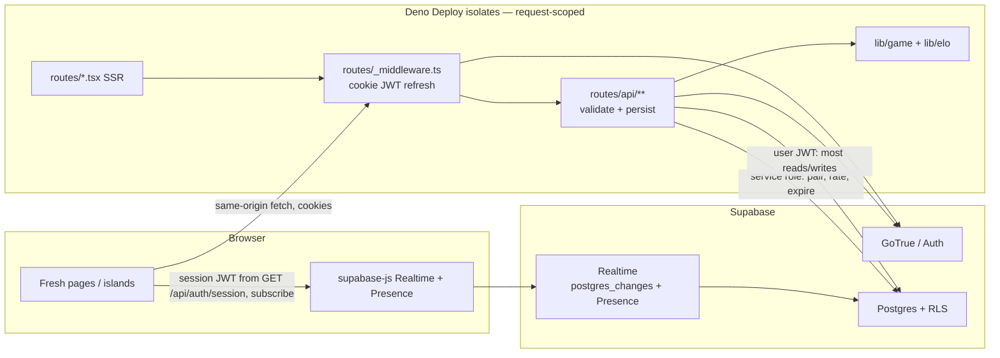
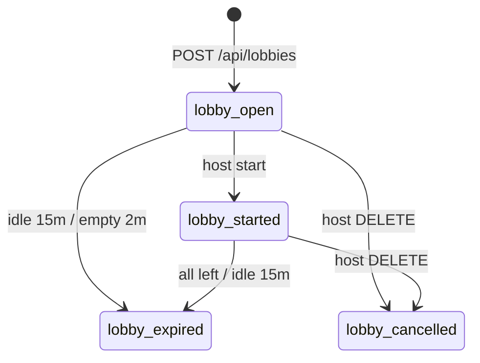
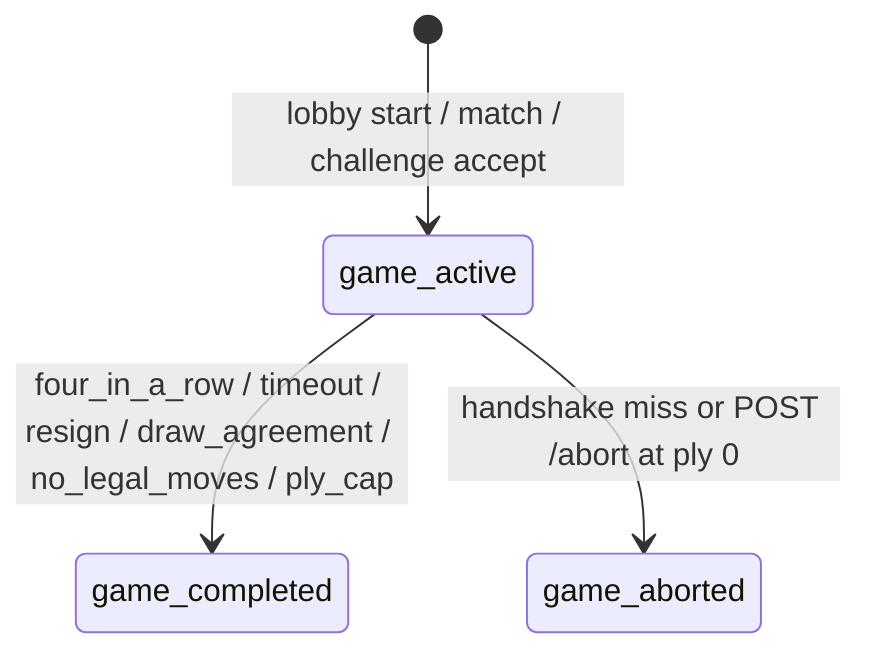
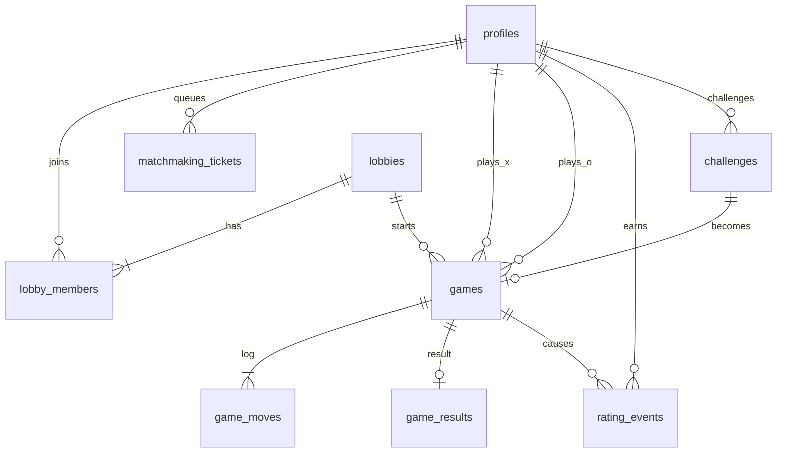

# 16spaces technical design

| Field | Value |
| --- | --- |
| **Title** | 16spaces: Serverless Multiplayer |
| **Date** | 2026-08-16 |
| **Status** | Draft / planning — implementation of multiplayer has not started |
| **Repo** | https://github.com/itsnotqwerty/16spaces |
| **Live** | https://16space.deno.dev |
| **Audience** | Engineers implementing this repo |

Product rules and UX: [spec.md](spec.md). PR plan and flags rollout: [roadmap.md](roadmap.md). This file is the implementer's architecture spec. Decisions match the approved design; do not invent schema or APIs here.

---

## Key Decisions

| # | Decision | Rationale |
| --- | --- | --- |
| K1 | **Supabase Realtime is the notify path; Fresh `routes/api/*` is the only write path.** Browser clients never `from('lobbies'|'games'|…)` except Realtime subscribe after membership. Writes go through Fresh, which calls service-role / `SECURITY DEFINER` RPCs. Presence is the only client-originated Realtime write. | Isolates are ephemeral. Supabase already provides durable Postgres + fan-out. Deno Deploy WebSockets + `BroadcastChannel` still need a DB and re-implement pub/sub. |
| K2 | **Game state is server-authoritative.** Clients propose moves; `lib/game` validates on the server. Win, timeout, abort, and rating are never trusted from the client. | Today's `islands/Board.tsx` + `islands/GameManager.tsx` compute win and clock locally. That cannot survive a network opponent. |
| K3 | **Clocks are timestamp math, not a ticking process.** Store `remaining_ms_*` + nullable `turn_started_at`. Remaining = stored − elapsed since turn start **only after clocks have started**. Flag-fall is claimed lazily on GET/move/claim/`GET /api/me`. | Deno Deploy has no always-on ticker. A client `setInterval` is display-only. |
| K4 | **Supabase Auth + httpOnly cookies on Fresh.** Email/password, magic link, GitHub, Google, and anonymous guests. Middleware **verifies** the access JWT (jose + `SUPABASE_JWT_SECRET` HS256) before attaching `ctx.state.user`. Unsigned payloads never become a user. | Matches the "use Supabase if you need a DB/auth" constraint. No Redis session store. Decode-without-verify plus admin writes is impersonation. |
| K5 | **Guest play in v1; account linking in Phase 2.** Guests may play local, unrated lobby, unrated challenge, and unrated queue only. Guest cookies last 7 days; we do not merge guest history into a later account. | Low first-game friction. `linkIdentity` is feasible but a separate, easy-to-get-wrong auth surface. |
| K6 | **Matchmaker is a Postgres transaction on enqueue + client poll.** `FOR UPDATE SKIP LOCKED`, expanding rating window. No worker. No `pg_cron` in v1. | Pairing only on enqueue can miss a simultaneous pair; status poll every 3s retries and expands the window. |
| K7 | **Classic ELO, initial 1000.** Provisional: first 10 rated games K=40, then K=20. `newRating = max(100, round(old + K*(S-E)))` (JS `Math.round`, half away from 0 for positive deltas). `wins`/`losses`/`draws` increment **only on rated** games. Leaderboard requires 5 rated games. Guests and `user_*` placeholders cannot play rated. | Matches the hardcoded `elo: 1000` in `GameManager.tsx`. Integer column needs a rounding rule. Rated-only W/L/D keeps the leaderboard honest. |
| K8 | **Move log is append-only `game_moves` plus a snapshot on `games`.** Unique `(game_id, ply)` is the idempotency key. Realtime: **replace** island state from `games` UPDATE; append a ploy from `game_moves` INSERT only if that ply is new. | Games are short; snapshot makes GET cheap; ply uniqueness makes double-submit safe; double-subscribe must not double-apply. |
| K9 | **Draws exist by agreement or by the 400-ply cap.** Timeout, resign, and no-legal-move are losses. No draw by repetition or 50-move rule in v1. Ply-cap is stored as `terminal_reason=ply_cap` and rated as a draw (`S=0.5`). | Endless-move is possible once both players have 5 stones. 400 half-moves is the only automatic draw (not 200 — that number is a storage estimate only). |
| K10 | **Core rules are frozen.** 4×4, max 5 stones, 8-direction adjacent move, 4-in-a-row. The two long diagonals in `checkWin` are **correct**, not a bug. | On a 4×4, a 4-long diagonal can only be the main and anti-diagonal. Shorter diagonals are length 2–3. |
| K11 | **Online clocks start when both players have heartbeated, not at INSERT.** `clocks_started_at` / `turn_started_at` stay NULL until then. Local hot-seat keeps "clock starts after first move." | Starting X's clock at INSERT rates a no-show as X's timeout. Handshake + abort (K17) is the fair serverless substitute for a start-of-game referee. |
| K12 | **No spectators in v1.** RLS does not grant board/move SELECT to non-participants. Presence channels are **not** a security boundary (anyone who knows `game:{id}` / `lobby:{code}` can join Presence unless Realtime Authorization is on). | Cheap later (RLS widening + read-only island). Board data stays on RLS regardless of Presence. |
| K13 | **Local hot-seat stays working on `/local` for the entire rollout.** Feature flags default **false** unless the env value is the string `true`. Flags gate **create/enqueue/start/challenge/rated-new** only — never in-flight move/claim/resign/draw/GET. | Prototype must not regress. Rollback must let existing games finish. |
| K14 | **Host-configurable options, locked at `games` insert:** time preset (including increment), rated, color assignment, privacy. X always moves first. `PATCH rated=true` fails if any member is a guest or has a `user_*` placeholder. Guest join fails when `lobbies.rated=true`. | Options belong on the lobby/queue, not mid-game. Start-time-only checks are too late. |
| K15 | **Hand-rolled cookie adapter on `supabase-js` (not `@supabase/ssr`).** Access JWT is **never** serialized into island HTML props. Islands call `GET /api/auth/session` on mount and every 50 minutes. `Secure` on cookies only when `SITE_URL` is `https:`. | `@supabase/ssr` targets Next/SvelteKit cookie APIs; Fresh 1.7 still needs `getCookies`/`setCookie`. SSR props are as stealable as localStorage. |
| K16 | **Leaderboard, public profiles, and public-open lobby browse are world-readable without a session.** `public_lobbies` is a **`SECURITY DEFINER`** view exposing `host_username` + `member_count` (filter `privacy=public AND status=open`). `REVOKE SELECT ON lobbies FROM anon, authenticated`. Anon may SELECT `profiles` and `public_lobbies` only. Do **not** auto-guest just to read. | Invoker views inherit member-only RLS and return zero rows to anon. Granting `lobbies` SELECT to anon leaks private codes. |
| K17 | **Ply-0 handshake abort is unrated and is not an ELO dodge.** After 45s at ply 0 with either last-seen still NULL, `resolve_clocks` aborts (no ELO). **Rated:** no `POST /abort` at all — only the 45s resolver. **Unrated:** `POST /abort` only if the **opponent's** last-seen is still NULL. If both last-seens are set, the abort TX starts clocks and returns **403**. | A voluntary rated abort before the opponent heartbeats is shopping for a weaker opponent. |
| K18 | **One engagement slot, not a naive XOR.** A user occupies exactly one of: `(lobby L + L.game_id if any)`, `standalone active game` (match/challenge), `queued ticket`, `open lobby with no game`, `outgoing pending challenge`. **Start/rematch is allowed when the only slot is this `lobby_id`.** Incoming pending challenges do **not** occupy the opponent. A 409 accept **declines** that challenge (does not leave it `pending`). | Literal XOR of `{queue, game, lobby}` rejects the host's own Start. |
| K19 | **Private lobby join is `join_lobby(code)` (service-role / `SECURITY DEFINER`), exact-code only.** No table-wide SELECT on private open lobbies. Same admin path inserts `games` on start/accept. | User-JWT SELECT cannot see a private row the joiner is not yet a member of; opening SELECT to all `status=open` leaks codes via Realtime. |
| K20 | **Lazy timeout/abort on GET is an allowed, idempotent side effect.** `GET /api/games/:id` and `GET /api/me` may finalize a game (and apply ELO if rated). Not CSRF: cookies are `SameSite=Lax` and these GETs only write the caller's own games. | Serverless clocks have no ticker. Documented exception to "mutating API is JSON POST." |
| K21 | **Access JWTs are verified, never merely decoded.** `lib/auth.ts` uses `jose` + `SUPABASE_JWT_SECRET` (HS256, issuer `${SUPABASE_URL}/auth/v1`, audience `authenticated`). Only a verified `sub` may load `profiles` and authorize admin RPCs. `getUser`/refresh is the fallback when verify fails or `exp < now()+60s`. | Last revision's "decode, skip getUser" plus `supabaseAdmin()` is trivial impersonation. |

---

## Overview

16spaces is a 4×4 two-player abstract game (a Tic-Tac-Toe variant with a stone cap and sliding) implemented as a Deno Fresh 1.7.3 app. Today it is a **single-route, single-browser hot-seat prototype**: `routes/index.tsx` mounts `islands/GameManager.tsx`, which owns local Preact state and a `setInterval` clock. There are no API routes, no auth, no database, and no WebSockets. The UI already *looks* like multiplayer (names, ELO 1000, connection dots, move list, clocks) but player O is hardcoded `isConnected: false`.

This design takes that prototype to a **complete multiplayer game** — auth, private/public lobbies, ELO matchmaking, and host-set game options — while remaining **fully serverless** on Deno Deploy with Postgres + Auth + Realtime from Supabase. Isolates stay request-scoped. There is no long-lived game server, no dedicated worker, no Redis, no VM.

The implementation strategy is incremental: extract a shared rules engine so local and online use the same logic, keep `/local` green, then add auth, lobbies, online play, matchmaking, and rated games behind flags.

---

## Background & Motivation

### Current state (verified in-repo)

| Area | What exists |
| --- | --- |
| Stack | Deno, Fresh **1.7.3**, Preact **10.22**, Tailwind **3.4.1** (`deno.json`). Deno std **0.216.0**. `nodeModulesDir: auto` only for PostCSS/Tailwind. |
| Deploy | `.github/workflows/deploy.yml` → `denoland/deployctl@v1`, project `16spaces`, entrypoint `main.ts`. Triggers on `main` push and PRs. CI installs **Deno 2.x** (`denoland/setup-deno@v2`, `deno-version: v2.x`). |
| Routes | `routes/index.tsx` (home + AdSense + `<GameManager />`), `routes/_app.tsx` (OG/Twitter, AdSense, **duplicate `<title>`**), `routes/_404.tsx` (stock Fresh lemon 404). **No `routes/api/`, no `_middleware.ts`.** |
| Islands | `GameManager.tsx`, `Board.tsx`, `Sidebar.tsx`. All game logic lives in islands. |
| Components | `components/Space.tsx` (cell), `components/Ploy.tsx` (move-list row). Presentational only. |
| Docs | Planning docs live in `docs/` (this file, `spec.md`, `roadmap.md`). `.gitignore` ignores a root `design.md`. |
| Marketing | `_app.tsx` already claims "Multiplayer Web Game"; OG url `https://16space.deno.dev`. Footer ©2025 Samuel Roux + GitHub link. `static/ads.txt` + slot `1847367891`. |

### Game as implemented (`islands/Board.tsx`, `islands/GameManager.tsx`)

- **Board:** 4×4. Coordinates: rows `x` ∈ 0..3 rendered as labels `1..4`; columns `y` ∈ 0..3 rendered as `A..D`. Notation `A1` = `(x=0,y=0)` top-left. Relocations `A1->B2`.
- **Turn:** place on empty cell if `countStones(currentPlayer) < 5`, **or** select own stone and move to an **8-adjacent** empty cell (`dx,dy ≤ 1`, not self). No capture, no jumping.
- **Win:** first 4-in-a-row, rows + columns + main diagonal `(i,i)` + anti-diagonal `(i,3-i)`. On 4×4 these are **all** 4-long lines. **Keep this.** The in-game rules modal already says "horizontally, vertically, or diagonally."
- **Clock:** bank **150s** (`maxTime` state). `setInterval` 1s. Starts after the **first** move, then ticks the player **to move**. At 0, opponent wins. `maxTime` has **no UI**.
- **Hot-seat:** both colors in one browser. `handleMove` / `handleWin` / `handleReset` are local. Reset is a button on the board.
- **Sidebar:** names, ELO, green/gray connection dots, clocks (red under 30s), "ploys" table, winner banner.

### Bugs / debt to fix while extracting the engine

1. **Shared-row board init** in `Board.tsx` (`Array(4).fill(Array(4).fill(null))` and the same in `resetGame`). Four rows alias one array until the first immutable `map`. `lib/game` must allocate 16 independent cells.
2. **Duplicated `currentPlayer`** in `Board` and `GameManager`. Single state after extract.
3. **`handleMove` mutates** ploy objects inside `.map` and the `if (newPloys.length > index)` branch is unused in practice (O's move always writes the same index X just created). Engine should append one ply per half-move and let the sidebar pair X/O for display.
4. **Client-authoritative win and clock.** Must not ship online.
5. **Duplicate `<title>` and duplicate AdSense loader** in `_app.tsx` / `index.tsx`.

### Why now

The chrome already promises multiplayer (ELO, connection dots, "Multiplayer Web Game"). Shipping real opponents, accounts, and rated play is the product. The constraint that makes this a design problem rather than "add Socket.io" is **Deno Deploy isolates + no always-on process**.

---

Goals, non-goals, and Phase 2: [spec.md](spec.md) and [roadmap.md](roadmap.md).

---

## Proposed Design

### High-level architecture



**Write path:** island `fetch('/api/...')` → middleware attaches `ctx.state.user` → handler validates with `lib/game` → single Postgres transaction → row change.

**Notify path:** other client(s) subscribed to `postgres_changes` on that `games` / `game_moves` / `lobbies` / `matchmaking_tickets` row receive the update. Islands apply the snapshot. No Deno Deploy WebSocket.

**Presence path:** island joins Realtime channel `lobby:{code}` or `game:{id}` with `track({ userId, username })`. Sidebar dots read Presence, not the DB. Leave/host-transfer still goes through the API so the durable member list is correct if Presence drops.

**Fallback:** if the Realtime socket is down, islands poll `GET /api/games/:id` or `GET /api/matchmaking/status` every 2–3s.

### Isolate constraints (non-negotiable)

| Constraint | Implication |
| --- | --- |
| Isolates are ephemeral; memory dies | No in-process matchmaker, game loop, or socket registry |
| No always-on ticker | Clocks = timestamps; timeouts claimed on read/move/claim |
| Request CPU/time limits | Move handler is O(board) (~16 cells); pairing is one `SELECT … FOR UPDATE SKIP LOCKED` |
| No Redis / no extra VM | Postgres is the lock manager, queue, and rate-limit store |
| Fresh 1.7 has no WS helper | We do not add `Deno.upgradeWebSocket` for gameplay |

### Target load (hobby, design to 10×)

| Metric | v1 target | Headroom assumption |
| --- | --- | --- |
| Concurrent online games | 50 | 500 |
| Concurrent queued users | 20 | 200 |
| Concurrent lobby members | 40 | 400 |
| Move rate (all games) | ~5/s peak | 50/s |
| Move write p95 | **< 250ms** isolate + PG (same region) | — |
| Realtime notify p95 | **< 400ms** after commit | — |
| Matchmaking wait (populated queue) | median < 15s | expanding window to 80s |
| Row size / game | snapshot ~1 KB + N × ~80 B moves; N typically 10–80 (hard cap **400** ply, K9) | ~32 KB/game at cap |
| Storage | 10k games ≈ tens of MB | Supabase free/pro is fine |

Pin Supabase to the **same region as the Deno Deploy project** (today: check Deploy dashboard; prefer `us-east-1` for both if undecided).

### Shared game engine

New module, imported by **islands and API handlers** (Fresh islands can import from `lib/` as long as the module is browser-safe: no `Deno.*`, no service role).

```
lib/game/types.ts
lib/game/board.ts      // emptyBoard, clone, countStones
lib/game/notation.ts   // A1 / A1->B2, columns A–D = y, rows 1–4 = x
lib/game/rules.ts      // legalMoves, applyMove, checkWin, hasLegalMove
lib/game/clock.ts      // remaining, afterLegalMove, flaggedPlayer — extracted in PR 1
lib/game/time_controls.ts // PRESETS map (single source of initialMs/incrementMs)
lib/game/index.ts
```

Canonical types:

```ts
// lib/game/types.ts
export type Player = "X" | "O";
export type Cell = Player | null;
export type Board = Cell[][]; // 4 rows (x) × 4 cols (y); each row a fresh array

export type PlaceMove = { kind: "place"; to: { x: number; y: number } };
export type SlideMove = { kind: "slide"; from: { x: number; y: number }; to: { x: number; y: number } };
export type Move = PlaceMove | SlideMove;

export type TimeControl = {
  id: string;          // preset id, e.g. "classic"
  initialMs: number;   // e.g. 150_000
  incrementMs: number; // Fischer, added after a legal move
};

export type GameSnapshot = {
  board: Board;
  toMove: Player;
  ply: number;              // half-moves committed; next submit must send this ply
  stonesPlaced: { X: number; O: number }; // redundant with count but cheap
  winner: Player | null;
  terminal: null | {
    reason:
      | "four_in_a_row"
      | "timeout"
      | "resign"
      | "draw_agreement"
      | "no_legal_moves"
      | "ply_cap"
      | "abort";
    winner: Player | null; // null iff draw_agreement, ply_cap, or abort
  };
  clock: {
    remainingMs: { X: number; O: number };
    turnStartedAt: string | null; // ISO; null until clocks running (online handshake or local first move)
    clocksStarted: boolean;
  };
};

export type ApplyResult =
  | { ok: true; applied: true; snapshot: GameSnapshot; notation: string }
  | { ok: true; applied: false; snapshot: GameSnapshot; timedOut: true }
  | { ok: false; error: "illegal" | "not_your_turn" | "game_over" };
// `clocks_not_started` is an **online handler** 409, not an engine error.
```

Rules extracted from `Board.tsx`:

```ts
// Sketch — lib/game/rules.ts
export function isAdjacent(from: Coord, to: Coord): boolean {
  const dx = Math.abs(from.x - to.x);
  const dy = Math.abs(from.y - to.y);
  return dx <= 1 && dy <= 1 && dx + dy > 0;
}

export function checkWin(board: Board): { winner: Player; line: [number, number][] } | null {
  const lines: [number, number][][] = [
    ...board.map((row, i) => row.map((_, j) => [i, j] as [number, number])),
    ...board[0].map((_, col) => board.map((_, row) => [row, col] as [number, number])),
    board.map((_, i) => [i, i] as [number, number]),
    board.map((_, i) => [i, board.length - 1 - i] as [number, number]),
  ];
  for (const line of lines) {
    const cells = line.map(([x, y]) => board[x][y]);
    if (cells.every((c) => c === "X")) return { winner: "X", line };
    if (cells.every((c) => c === "O")) return { winner: "O", line };
  }
  return null;
}

export function applyMove(s: GameSnapshot, player: Player, move: Move, now: Date): ApplyResult {
  if (s.terminal) return { ok: false, error: "game_over" };
  // Do NOT reject !clocksStarted — that is the local first move (K11) and tests.
  // Online POST /move checks clocksStarted (or resolve_clocks) **before** calling applyMove.
  const flagged = s.clock.clocksStarted ? flaggedPlayer(s.clock, s.toMove, now) : null;
  if (flagged) {
    // Do NOT apply `move`. Do NOT add increment. Handler returns 200 + terminal snapshot.
    return { ok: true, applied: false, timedOut: true, snapshot: finalizeFlag(s, flagged) };
  }
  if (player !== s.toMove) return { ok: false, error: "not_your_turn" };
  // place if empty && count < 5; slide if from==player && to empty && adjacent
  // then afterLegalMove (starts clock if turnStartedAt was null)
  // then checkWin; else if !hasLegalMove(next) next player loses;
  // else if next.ply === 400 → ply_cap draw
  return { ok: true, applied: true, snapshot, notation };
}
```

**No-legal-move:** after a successful move, if the opponent has zero legal places/slides, the game ends `no_legal_moves` and the mover wins. This is possible in principle with 5+5 stones and trapped groups. Do not skip the turn.

**Notation** stays exactly as `Board.tsx` formats it (`String.fromCharCode(65 + y)${x + 1}` and `from->to`) so the existing `Sidebar` / `Ploy` table does not change.

**Tests:** `lib/game/*.test.ts` via `deno test` in **PR 1** (engine surface used online is complete here, including `clock.ts`). Cover: shared-row independence, place cap, non-adjacent reject, both diagonals, a 3-long diagonal does **not** win, **flag-fall on apply does not place the stone**, increment added to the mover after a legal move, **first local move succeeds when `clocksStarted` is false and then starts the clock**, `afterLegalMove` with `turnStartedAt === null` uses stored remaining, ply increment, ply 400 forces `ply_cap`. Idempotency is the handler's job, not the engine's.

Add `jose` to `deno.json` imports (pinned, e.g. `https://esm.sh/jose@5.9.6`) for K21.

Add to `deno.json`:

```json
"lib/": "./lib/",
"@supabase/supabase-js": "https://esm.sh/@supabase/supabase-js@2.49.1"
```

and a task `"test": "deno test -A lib/"`.

### Clock authority

```ts
// lib/game/clock.ts
export function remainingMs(
  stored: number,
  toMove: Player,
  me: Player,
  turnStartedAt: Date | null,
  now: Date,
): number {
  if (!turnStartedAt || me !== toMove) return stored;
  return Math.max(0, stored - (now.getTime() - turnStartedAt.getTime()));
}

export function afterLegalMove(
  clock: GameSnapshot["clock"],
  mover: Player,
  next: Player,
  incrementMs: number,
  now: Date,
): GameSnapshot["clock"] {
  const startedAt = clock.turnStartedAt ? new Date(clock.turnStartedAt) : null;
  // null turnStartedAt (local first move, or a caller that started clocks this instant): no time has elapsed.
  const used = remainingMs(clock.remainingMs[mover], mover, mover, startedAt, now);
  return {
    remainingMs: {
      ...clock.remainingMs,
      [mover]: used + incrementMs,
    },
    turnStartedAt: now.toISOString(),
    clocksStarted: true,
  };
}
```

**Online handshake (K11 / K17):** `INSERT INTO games` leaves `clocks_started_at` and `turn_started_at` **NULL**, `remaining_ms_* = initial_ms`, `x_last_seen_at` / `o_last_seen_at` NULL. Clocks do **not** run. The **online handler** returns **409** `{ code: "clocks_not_started" }` and does **not** call `applyMove`. A 409 re-triggers the island heartbeat.

`POST /api/games/:id/heartbeat` (required for clocks to ever start):

```
BEGIN;
SELECT * FROM games WHERE id = $id FOR UPDATE;
-- 403 if caller is not x_user_id / o_user_id
-- set x_last_seen_at or o_last_seen_at = now()
-- if both last-seens are non-null AND clocks_started_at IS NULL:
--    clocks_started_at = turn_started_at = now()
COMMIT;
return { clocksStarted };
```

Two concurrent heartbeats serialize on the row lock; the second sees the first last-seen and starts clocks.

`OnlineGame` **must** `POST /heartbeat` on mount, on `visibilitychange`/`focus`, and every **15s** until `clocksStarted || terminal`. SSR `resolve_clocks` does **not** count as a heartbeat.

`HANDSHAKE_MS = 45_000`. `resolve_clocks(game, now)` — called from `GET /api/games/:id`, `POST …/claim-timeout`, `POST …/move`, `POST …/abort`, and `GET /api/me`:

1. If `status != active`, return unchanged (idempotent).
2. If `ply = 0` AND (`x_last_seen_at IS NULL` OR `o_last_seen_at IS NULL`) AND `now - created_at >= 45s` → **`abort`** (unrated, no ELO). Prefer this over timeout.
3. If both last-seens are set AND clocks not started → start clocks (`now`), do not finalize.
4. If clocks started AND `remainingMs(to_move) <= 0` → **`timeout`**, opponent wins, ELO if `rated`.
5. After the first legal move, missing heartbeats do not abort; only the clock / resign / draw / ply-cap end the game.

`POST /api/games/:id/abort` (caller is X or O, `ply = 0`, clocks not started):

| Game | Opponent last-seen | Result |
| --- | --- | --- |
| **Rated** | any | **403** `{ code: "rated_no_abort" }`. Only `resolve_clocks` after 45s may abort. |
| Unrated | NULL | **200** `abort` (unrated). True no-show. |
| Unrated | set | Same TX starts clocks if both set; **403**. Use resign after clocks start. |

Draw and resign before clocks started → **403** `{ code: "clocks_not_started" }`. Use abort (unrated no-show) or wait.

**Local (`/local`):** never persisted. Clocks start after the first committed move (X's opening is untimed). `afterLegalMove` with `turnStartedAt === null` uses stored remaining. `GameManager` owns the display interval and calls `lib/game` for rules.

**Flag-fall without a worker:**

1. `resolve_clocks` on the endpoints listed above is the only finalizer.
2. The client whose opponent's displayed time hits 0 POSTs `/claim-timeout` (the player on clock may also fire it; both are idempotent).
3. Sidebar interval is cosmetic. A delayed tab cannot "pause" the server clock.
4. If both tabs close, the next `GET /api/me` (home, after login) or any later `GET /api/games/:id` finalizes.

**Online games are persisted; local games are not.** Schema `NOT NULL` does not apply to `/local`. Online `turn_started_at` / `clocks_started_at` are nullable until the handshake completes.

### Real-time transport

**Chosen:** Supabase Realtime.

| Channel | Events | Who joins |
| --- | --- | --- |
| `ticket:{id}` | `postgres_changes` UPDATE on `matchmaking_tickets` (own row) | Queued player |
| `lobby:{code}` | changes on `lobbies` + `lobby_members`; Presence | Members (after join) |
| `game:{id}` | UPDATE `games`; INSERT `game_moves`; Presence | The two players |
| `challenge:{id}` | UPDATE `challenges` (own row) | Challenger and opponent |

**Apply rule (do not double-apply):**

- On `games` UPDATE: **replace** island snapshot with `payload.new` (source of truth: board, ply, clocks, draw offer, terminal).
- On `game_moves` INSERT: append to the ploy list **only if** `payload.new.ply` is not already present. Do **not** call `applyMove` locally on that INSERT.

**Replica identity + publication (required or UPDATE payloads are PK-only and the 400ms notify SLO is dead):**

```sql
ALTER TABLE games REPLICA IDENTITY FULL;
ALTER TABLE game_moves REPLICA IDENTITY FULL;
ALTER TABLE lobbies REPLICA IDENTITY FULL;
ALTER TABLE lobby_members REPLICA IDENTITY FULL;
ALTER TABLE matchmaking_tickets REPLICA IDENTITY FULL;
ALTER TABLE challenges REPLICA IDENTITY FULL;

ALTER PUBLICATION supabase_realtime ADD TABLE
  games, game_moves, lobbies, lobby_members, matchmaking_tickets, challenges;
```

Also flip each table to Enabled in the Supabase dashboard **Realtime** page. Both the SQL publication **and** the dashboard toggle are required.

**Presence is best-effort, not a security boundary.** Channel names `game:{uuid}` / `lobby:{code}` are joinable by any client that knows the name unless the project has Realtime Authorization / private channels enabled (turn that on in the dashboard if the plan supports it; v1 does not depend on it). Board and move data stay behind RLS. Sidebar dots may be spoofable; that does not leak the board.

Client construction (island). **Do not put the access JWT in page props.** The SSR page passes only `{ supabaseUrl, supabaseAnonKey }` from `Deno.env.get` (server-only). The island fetches the token:

```ts
// islands/OnlineGame.tsx
// 1. POST /api/games/:id/heartbeat on mount, on focus/visibilitychange, every 15s
//    until clocksStarted || terminal. 409 on move → heartbeat again.
// 2. Session token on mount + every 50 minutes + on 401:
const session = await fetch("/api/auth/session", { credentials: "same-origin" }).then((r) => r.json());
const supabase = createClient(props.supabaseUrl, props.supabaseAnonKey, {
  global: { headers: { Authorization: `Bearer ${session.accessToken}` } },
  realtime: { params: { eventsPerSecond: 10 } },
});
const ch = supabase.channel(`game:${gameId}`)
  .on("postgres_changes", { event: "UPDATE", schema: "public", table: "games", filter: `id=eq.${gameId}` }, (e) => {
    setGame(e.new); // replace snapshot
  })
  .on("postgres_changes", { event: "INSERT", schema: "public", table: "game_moves", filter: `game_id=eq.${gameId}` }, (e) => {
    setMoves((prev) => prev.some((m) => m.ply === e.new.ply) ? prev : [...prev, e.new]);
  })
  .on("presence", { event: "sync" }, () => setConnected(ch.presenceState()))
  .subscribe();
```

`SUPABASE_URL` and `SUPABASE_ANON_KEY` are public (RLS is the security boundary). Fresh 1.7 islands cannot call `Deno.env.get`; the page handler must pass them as props. **`SUPABASE_SERVICE_ROLE_KEY` is a Deno Deploy secret only.**

Enable Realtime on tables listed in the `ALTER PUBLICATION` above. Do **not** enable on `rating_events`, `rate_limits`, or `profiles` (v1 leaderboard is pull).

### Product surface and routing

Fresh file-based routes. `_app.tsx` keeps the `#161512` dark shell, single `<title>`, OG tags, and AdSense **script once**. A new `components/Layout.tsx` (not an island) provides top nav: logo, Play, Leaderboard, username or Sign in.

| Route | Kind | Auth | Purpose |
| --- | --- | --- | --- |
| `routes/index.tsx` | page | optional | Home: Play Rated, Play Unrated, Create Lobby, Join by code, Play Local, Leaderboard. AdSense above/below. **No embedded live board.** |
| `routes/local.tsx` | page | none | Current `GameManager` hot-seat. Time-preset select wired to `maxTime`. |
| `routes/login.tsx` | page | guest | Email/password, magic link, OAuth buttons, "Play as guest". |
| `routes/signup.tsx` | page | guest | Email/password. |
| `routes/l/[code].tsx` | page | required (guest ok) | Lobby island. |
| `routes/c/[id].tsx` | page | required | Challenge accept/decline. Participants only. Share URL from `POST /api/challenges`. |
| `routes/queue.tsx` | page | required | Matchmaking wait + cancel. |
| `routes/play/[id].tsx` | page | required, must be a player | Handler runs `resolve_clocks` then SSRs `{ game, moves, supabaseUrl, supabaseAnonKey, me: { id, username, rating } }` (**no access token, no email**). Island POSTs `/heartbeat` on mount, then `GET /api/auth/session` + Realtime. Refresh = resume. |
| `routes/u/[username].tsx` | page | optional | Profile + match history. |
| `routes/leaderboard.tsx` | page | optional | Top 50. |
| `routes/settings.tsx` | page | required | Change username. Link-account placeholder hidden until Phase 2. |
| `routes/_middleware.ts` | mw | — | Session, flags, skip `internal`/`static`. |
| `routes/api/**` | handlers | see API section | Writes + JSON reads. |
| `routes/_404.tsx` | page | — | Restyle to the dark theme (drop Fresh lemon). |

Home buttons (unauthenticated):

- **Play Local** — always, no session.
- **Play Unrated / Create Lobby / Join by code** — `POST /api/auth/guest` then continue (one click).
- **Play Rated** — requires a non-guest, non-`user_*` account. Button links to `/login?next=/queue?rated=1` and explains why.
- **Leaderboard / public profiles / public lobby browse** — no session, no auto-guest (K16).

### Island split (reuse Board / Sidebar)

```
islands/Board.tsx          # presentational + click UX; no win/clock/reset ownership
islands/Sidebar.tsx        # + resign / offer-draw / accept-draw; presence dots
                           # winState: "X" | "O" | "draw" | "aborted" | null
                           # draw covers draw_agreement + ply_cap
islands/GameManager.tsx    # LOCAL only; uses lib/game; time preset UI
islands/OnlineGame.tsx     # heartbeat + fetch + Realtime + claim-timeout
islands/ChallengeRoom.tsx  # /c/:id accept/decline
islands/LobbyRoom.tsx
islands/QueueWait.tsx
islands/AuthForm.tsx
islands/HomeMenu.tsx       # join-code, create-lobby, queue, incoming challenges
islands/UsernameForm.tsx
```

`Board` props after the split:

```ts
type BoardProps = {
  board: Board;
  toMove: Player;
  myColor: Player | null;      // null in local = both
  selected: Coord | null;
  winningLine: [number, number][] | null;
  disabled: boolean;           // not my turn, game over, or replay
  onIntent: (move: Move) => void;
  // legal-move hints computed client-side via lib/game.legalMoves — UX only
};
```

Reset exists **only** on `/local`. Online games never reset in place; "Play again" returns to the lobby (same code, new game) or re-queues.

Rules modal stays on the board (copy from spec). Move it out of a `<ul>` that currently wraps the Close button.

### Auth and session (Fresh 1.7 + Deno Deploy)

**Providers (Supabase dashboard + this app):**

| Method | v1 | Notes |
| --- | --- | --- |
| Email + password | yes | Confirm-email **off** for low friction. Password min 8. |
| Magic link | yes | `signInWithOtp({ email, options: { emailRedirectTo: SITE_URL + "/api/auth/callback" } })` |
| GitHub OAuth | yes | |
| Google OAuth | yes | |
| Anonymous | yes | `signInAnonymously()`. Trigger inserts placeholder `user_`+8; API then updates to `Guest` + 4 Crockford and `is_guest=true`. |
| Phone | no | |

**Cookies** (`$std/http/cookie.ts`, already on std 0.216.0) via `lib/auth_cookies.ts`:

| Name | Contents | Attrs |
| --- | --- | --- |
| `sb-access-token` | Supabase access JWT | `HttpOnly`, `SameSite=Lax`, `Path=/`, `Max-Age=session.expires_in` (~3600), **`Secure` iff `SITE_URL` protocol is `https:`** |
| `sb-refresh-token` | Refresh token | same, `Max-Age=60*60*24*7` |
| `sb-pkce` | PKCE `code_verifier` | same, `Max-Age=600`, set only during OAuth/magic redirect |

`http://localhost:8000` must **not** set `Secure` or the browser drops the cookies.

No `localStorage` session. Island memory holds the access JWT only after `GET /api/auth/session`.

**Cookie adapter (K15) — not `@supabase/ssr`:**

`lib/auth_cookies.ts` implements the supabase-js `SupportedStorage` interface (`getItem` / `setItem` / `removeItem`) on top of the incoming `Request` cookies and a mutable `Headers` buffer:

- Map `${storageKey}-code-verifier` → cookie `sb-pkce`.
- Do **not** persist the full session JSON in a readable cookie; after `exchangeCodeForSession` / `signInWithPassword` the handler copies `session.access_token` / `session.refresh_token` into the two httpOnly cookies above.
- Create the server client with `auth: { flowType: "pkce", persistSession: false, autoRefreshToken: false, storage: cookieAdapter }`.

OAuth/magic **start** and **callback** must run in this adapter so the verifier survives isolate death. If `/api/auth/callback` sees `code` but no `sb-pkce` cookie (link opened on another device/browser), return **400** HTML: "Open this link in the same browser you used to request the email." No implicit/token-hash fallback in v1.

**`routes/_middleware.ts`** (only when `ctx.destination === "route"`). Skip entirely for `internal` / `static` and for `GET /api/health`.

```ts
import { FreshContext } from "$fresh/server.ts";
import { getCookies, setCookie } from "$std/http/cookie.ts";

export type AppState = {
  requestId: string;
  user: null | {
    id: string;
    email: string | null;
    isGuest: boolean;
    username: string;
    rating: number;
    ratedGames: number;
  };
  accessToken: string | null;
};

export async function handler(req: Request, ctx: FreshContext<AppState>) {
  ctx.state.requestId = crypto.randomUUID();
  if (ctx.destination !== "route") return ctx.next();
  const path = new URL(req.url).pathname;
  if (path === "/api/health") {
    const resp = await ctx.next();
    resp.headers.set("X-Request-Id", ctx.state.requestId);
    return resp;
  }
  const cookies = getCookies(req.headers);
  const access = cookies["sb-access-token"];
  const refresh = cookies["sb-refresh-token"];
  // 1. If access JWT present: jose.jwtVerify(access, SUPABASE_JWT_SECRET, {
  //      algorithms: ["HS256"], issuer: `${SUPABASE_URL}/auth/v1`, audience: "authenticated"
  //    }). On success and exp > now()+60s: load profiles by verified `sub`. NEVER attach user
  //    from an unverified payload. (K21)
  // 2. If verify fails OR expiring/missing && refresh: auth.refreshSession({ refresh_token }).
  //    Re-verify the new access token. If that fails: auth.getUser(access) once.
  //    Buffer Set-Cookie; apply after ctx.next().
  // 3. Attach ctx.state.user from profiles only after step 1 or 2 succeeded.
  // 4. if path requires auth (see table) && !user → 303 /login?next=
  // 5. if path requires full account (rated queue) && (user.isGuest || /^user_/.test(username))
  //    → 303 /signup?reason=rated  (or /settings if OAuth placeholder)
  const resp = await ctx.next();
  resp.headers.set("X-Request-Id", ctx.state.requestId);
  return resp;
}
```

Local **verify** (HMAC with the project JWT secret) avoids a GoTrue RTT on every move without trusting an unsigned `sub`. `getUser`/refresh is the slow path for expiry or a bad signature. Log `authMs` separately from `pgMs` on `game.move`.

`SUPABASE_JWT_SECRET` is the "JWT Secret" from the Supabase project API settings (HS256). Deno Deploy secret; never sent to islands. JWKS/`ES256` is not used — hosted Supabase access tokens are HS256 with this secret.

**Two server clients** in `lib/supabase.ts`:

```ts
import { createClient, SupabaseClient } from "@supabase/supabase-js";

export function supabaseAnon() {
  return createClient(Deno.env.get("SUPABASE_URL")!, Deno.env.get("SUPABASE_ANON_KEY")!);
}

export function supabaseAsUser(accessToken: string) {
  return createClient(Deno.env.get("SUPABASE_URL")!, Deno.env.get("SUPABASE_ANON_KEY")!, {
    global: { headers: { Authorization: `Bearer ${accessToken}` } },
  });
}

export function supabaseAdmin() {
  return createClient(Deno.env.get("SUPABASE_URL")!, Deno.env.get("SUPABASE_SERVICE_ROLE_KEY")!, {
    auth: { persistSession: false, autoRefreshToken: false },
  });
}
```

Use **user JWT** for row reads/writes that RLS can express (own ticket, own profile, own membership after join). Use **service role** (`supabaseAdmin()`) only for this allowlist — each call is preceded by a TypeScript owner/host/player assertion:

| Admin / `SECURITY DEFINER` use | Why user JWT is insufficient |
| --- | --- |
| `join_lobby(code)` — exact-code lookup + insert member | Joiner is not a member yet; private row is invisible (K19) |
| `start_lobby` / `accept_challenge` — `INSERT INTO games` | `games` INSERT is denied to clients |
| `matchmake_enqueue` / `matchmake_tick` — pair two tickets + insert game | Must lock/update another user's ticket |
| `expire_stale_lobbies()` | Must update lobbies the caller does not host |
| `resolve_clocks` / `apply_game_result` | Writes both players' result + ratings |
| `healthcheck()` | No user |
| `GET /api/lobbies/:code` exact-code peek (private, pre-join) | Same as join; returns 404 if missing. Body never includes `board` / `moves` (K12). |

**GRANT EXECUTE** on those RPCs to `service_role` only. The browser never calls them.

Public reads (K16) use `supabaseAnon()` (no JWT): `profiles` SELECT and `public_lobbies` view. They are **not** on the admin allowlist.

**OAuth sequence:**

```mermaid
sequenceDiagram
  participant U as Browser
  participant F as Fresh isolate
  participant S as Supabase Auth
  participant P as GitHub/Google
  U->>F: GET /api/auth/oauth/github
  F->>S: signInWithOAuth (PKCE, redirectTo=/api/auth/callback)
  F->>U: Set-Cookie sb-pkce; 302 to provider
  U->>P: consent
  P->>F: GET /api/auth/callback?code=
  F->>S: exchangeCodeForSession(code)
  S->>F: session
  F->>U: Set-Cookie tokens; 303 / or next=
```

**New user — one writer for the first row:**

1. `0001_init.sql` includes `CREATE EXTENSION IF NOT EXISTS citext;` (allowed on hosted Supabase).
2. Trigger `on_auth_user_created` on `auth.users` INSERT **always** inserts `profiles (id, username, is_guest)` with `username = 'user_' || substr(replace(new.id::text, '-', ''), 1, 8)` and `is_guest = false`. The trigger never reads the email local-part (it can collide, fail the regex, or be empty). It never inserts `guest`.
3. **Email signup** with `{ username }` : after `signUp`/`signIn`, `PATCH` the placeholder to the claimed name (unique, reserved-list, regex). On collision, 409 and stay on `/settings`.
4. **Email signup without username**, and **every OAuth user:** keep `user_*`. Callback/signup 303s to `/settings?next=`. Rated enqueue/start is blocked while `username ~ '^user_'`.
5. **Guest:** `POST /api/auth/guest` calls `signInAnonymously()`, then **`supabaseAdmin()`** `UPDATE profiles SET username = 'Guest' || four_crockford, is_guest = true WHERE id = $id AND username LIKE 'user_%'`, retrying the four chars on unique violation (max 8 tries). Clients cannot set `is_guest`.

`user_*` is not on the reserved list as an exact name; the `^user_` prefix is the placeholder detector.

**Guest upgrade (Phase 2, not v1):** `supabase.auth.updateUser({ email })` or `linkIdentity({ provider })` on the same `auth.users.id` so game history and rating stay. Until then, guests who sign up get a **new** user; we do not merge. Signup UI copy: **"Sign in to keep a rating. Guest cookies last 7 days on this browser; we cannot merge guest history if you create a new account."**

### Lobbies

- **Code:** 6 chars from `ABCDEFGHJKLMNPQRSTUVWXYZ23456789` (no `0/O/1/I`). Unique. Share URL: `https://16space.deno.dev/l/ABC234`.
- **Privacy:** `public` listed on `GET /api/lobbies` via the `public_lobbies` view; `private` join-by-code only (exact-code admin lookup).
- **Create:** `POST /api/lobbies` locks the caller's `profiles` row, rejects if engaged, inserts `lobbies` **and** the host's `lobby_members` row in one admin TX (clients cannot INSERT `lobby_members`).
- **Capacity:** 2 players. (Spectators Phase 2.) **RLS is not the capacity lock.** `join_lobby` / `POST …/join` runs: `BEGIN; SELECT * FROM lobbies WHERE code=$c FOR UPDATE; SELECT count(*) FROM lobby_members WHERE lobby_id=$id; INSERT …; COMMIT;` and rejects with 409 if count ≥ 2. Optional trigger `lobby_members_cap` `RAISE` if `count(*) > 2` after insert, as a belt.
- **Host** is `lobbies.host_id`. Sets options via `PATCH` while `status=open`.
- **Rated invariants (K14):** `PATCH` that sets `rated=true` fails with 403 if any current member is `is_guest` or `username ~ '^user_'`. `join_lobby` of a guest/`user_*` into a `rated=true` lobby fails with 403. Start also re-checks both members.
- **Ready:** each `lobby_members.ready`. Start requires 2 members, both ready, caller is host.
- **Engagement on start (K18):** lock both `profiles` rows `FOR UPDATE`. Start/rematch **succeeds** if each member's only slot is **this** `lobby_id` (open lobby, or this started lobby whose `game_id` is not `active`). 409 if either has a queue ticket, a standalone active game, an outgoing pending challenge, or a **different** lobby.
- **Start:** lock lobby, insert `games` with **copied, frozen** options (`initial_ms`/`increment_ms` from `lib/game/time_controls.ts` PRESETS — never trusted from the client), set `lobbies.status=started`, `lobbies.game_id`, both members `ready=false`. Clients Realtime-navigate to `/play/{id}`. Occupying `(this lobby + this game)` is still one slot.
- **Play again:** when the **current** `games.status` is `completed` or `aborted` and both still in lobby, host may `POST /api/lobbies/:code/start` again (new game row). Same K18 check (this lobby is the only slot).
- **Leave:** delete member. If host left and one remains, that member becomes host. If zero remain, `status=expired`.
- **Presence:** Realtime Presence + `POST /api/lobbies/:code/heartbeat` every 15s (`lobby_members.last_seen_at`). Presence does not bump `lobbies.updated_at`.
- **Expire (`expire_stale_lobbies()`, called from list/get/join/lobby-heartbeat):** no cron.
  - Occupied idle: `status = 'open'` AND **has at least one member** AND no member with `last_seen_at > now() - 15 minutes` → `expired`.
  - **Never expire `started` while `game_id` references a `games.status = 'active'` row.** Players on `/play` send game heartbeats, not lobby heartbeats.
  - After that game is `completed`/`aborted`: `started` expires if no member `last_seen_at` within 15 minutes (or all left).
  - Empty: `status = 'open'` AND **zero members** AND `updated_at < now() - 2 minutes` → `expired`.
- **Cancel:** host `DELETE` handler sets `status=cancelled` (no row delete).

### ELO matchmaking

**Queues** are keyed by `(rated, time_control_id)`. A 3+0 player never pairs with Classic 150.

**Enqueue transaction:**

```sql
-- pseudocode executed in one TX via supabaseAdmin rpc `matchmake_enqueue`
INSERT INTO matchmaking_tickets (user_id, rated, time_control_id, rating, status, queued_at)
VALUES ($user, $rated, $tc, $rating, 'queued', now())
RETURNING *;

-- expanding window of THIS user (0s wait ⇒ ±50)
-- and of each candidate
SELECT t.* FROM matchmaking_tickets t
WHERE t.status = 'queued'
  AND t.rated = $rated
  AND t.time_control_id = $tc
  AND t.user_id <> $user
  AND t.rating BETWEEN $myRating - $myWindow AND $myRating + $myWindow
  AND $myRating BETWEEN t.rating - window(t.queued_at) AND t.rating + window(t.queued_at)
  AND NOT EXISTS (
    SELECT 1 FROM games g
    WHERE g.status = 'active'
      AND (g.x_user_id IN ($user, t.user_id) OR g.o_user_id IN ($user, t.user_id))
  )
ORDER BY t.queued_at
FOR UPDATE SKIP LOCKED
LIMIT 1;
```

```sql
-- window(queued_at) = LEAST(400, 50 + 50 * FLOOR(EXTRACT(EPOCH FROM now()-queued_at)/10))
```

If a candidate is locked: create `games` (color **random** for matchmaking; clocks **not** started — K17 handshake still applies even though both were in the queue), set both tickets `status=matched`, `game_id=…`. Commit.

If none: leave ticket queued. Client polls `POST /api/matchmaking/tick` every **3s** (also `GET` status). Tick re-runs the search with the **current** window so expansion works without a worker.

**Simultaneous enqueue:** if both TXs insert before either SELECT, both miss. The 3s tick closes that hole.

**Cancel:** `UPDATE … SET status='cancelled' WHERE id=$id AND user_id=$me AND status='queued'`.

**One ticket per user:** unique partial index `WHERE status = 'queued'`. Enqueue of a second ticket returns **200** and the existing ticket (does not insert, does not 409).

**Engagement (K18):** `matchmake_enqueue` starts with `SELECT * FROM profiles WHERE id=$user FOR UPDATE`. If the user already occupies any slot (lobby, standalone active game, queued ticket, outgoing pending challenge) → **409** `{ code: "already_engaged" }` and **no** ticket row. Pairing also skips candidates who became engaged after they queued (re-check under their profile lock).

`lib/engagement.ts` `occupation(uid)` (used by enqueue/join/start/create-challenge/accept) returns one of:

```ts
type Occupation =
  | { kind: "queue"; ticketId: string }
  | { kind: "lobby"; lobbyId: string; gameId: string | null } // includes started+active as ONE slot
  | { kind: "game"; gameId: string }                          // standalone match/challenge game
  | { kind: "challenge_out"; challengeId: string }
  | null;
```

Start/rematch: allowed iff `occupation.kind === "lobby" && occupation.lobbyId === thisLobby`. Accept challenge: 409 if opponent `occupation !== null`, and that challenge is set to `declined` (not left `pending`).

**Rated eligibility:** both users `profiles.is_guest = false` AND `username !~ '^user_'`. API rejects rated enqueue for guests and placeholders.

**Disconnect in queue:** ticket stays 60s after last tick (`updated_at`), then `expired`. Client tick is the heartbeat.

### Ratings

```
E = 1 / (1 + 10^((Ropp - R) / 400))
S ∈ {1 win, 0 loss, 0.5 draw}   // draw = draw_agreement or ply_cap
newRating = Math.max(100, Math.round(old + K * (S - E)))
```

`Math.round` is half-up away from 0 for the positive values we produce. Clamp **before** writing so `CHECK (rating >= 100)` cannot abort the TX.

| Rated games completed (before this one) | K |
| --- | --- |
| 0–9 (provisional) | 40 |
| 10+ | 20 |

- Initial rating **1000** (matches `GameManager` default).
- Each player uses **their own** K (asymmetric).
- Update **only** when a **rated** game reaches a terminal reason other than `abort`.
- **`abort` is always unrated** (45s handshake miss, or unrated `POST /abort` when the opponent never heartbeated). No `rating_events`. Rated games have **no** voluntary abort (K17). After clocks start, disconnect is the clock and **does** rate.
- Terminal reasons that rate (if `games.rated`): `four_in_a_row`, `timeout`, `resign`, `no_legal_moves` (win/loss), `draw_agreement`, `ply_cap` (draw).
- Persist `rating_events` (old, new, k, expected, score, opponent_id, game_id) **and** in the same transaction write `profiles.rating`, increment `rated_games`, and increment **exactly one** of `wins` / `losses` / `draws` (rated games only). Unrated `game_results` do not touch those four columns.
- Floor rating at **100**. No ceiling.

**Leaderboard:** `SELECT username, rating, rated_games, wins, losses, draws FROM profiles WHERE is_guest = false AND username !~ '^user_' AND rated_games >= 5 ORDER BY rating DESC, rated_games DESC LIMIT 50`. World-readable via `supabaseAnon()` (K16).

### Game options

Host (lobby) or queue picker (matchmaking). Copied onto `games` and **immutable**.

| Option | Values | Default | Matchmaking? |
| --- | --- | --- | --- |
| Time control | presets below | `classic` (150+0) | yes, queue key |
| Rated | `true` / `false` | lobby: false; buttons choose | yes, queue key |
| Color | `random` / `host_x` / `host_o` | `random` | always `random` |
| Privacy | `public` / `private` | create-private / browse-public | n/a |
| First move | X always | — | not configurable |

**Presets** (replace the unused `maxTime` state):

| `id` | Label | `initialMs` | `incrementMs` |
| --- | --- | --- | --- |
| `bullet30` | 30s | 30_000 | 0 |
| `1+0` | 1+0 | 60_000 | 0 |
| `2+1` | 2+1 | 120_000 | 1_000 |
| `classic` | Classic 2:30 | **150_000** | 0 |
| `3+0` | 3+0 | 180_000 | 0 |
| `3+2` | 3+2 | 180_000 | 2_000 |
| `5+0` | 5+0 | 300_000 | 0 |
| `5+3` | 5+3 | 300_000 | 3_000 |

Increment is **Fischer**: added to the mover's remaining **after** a legal move is committed, not after flag-fall.

Local page exposes the same preset list (no rated/privacy/color).

### Game lifecycle

Lobby and game are **separate** machines. Matchmaking / challenge games have `lobby_id` NULL.





Online `GameManager` equivalent (`OnlineGame`):

```mermaid
sequenceDiagram
  participant X as Player X island
  participant API as Fresh /api/games/:id/move
  participant PG as Postgres
  participant RT as Realtime
  participant O as Player O island
  X->>API: POST {ply, move, clientNonce}
  API->>API: lib/game.applyMove + clock
  alt illegal / wrong ply
    API-->>X: 409 or 422 + snapshot
  else ok
    API->>PG: TX lock games, insert move, update snapshot
    PG-->>RT: UPDATE games, INSERT game_moves
    API-->>X: 200 snapshot
    RT-->>O: snapshot
    O->>O: replace snapshot from games UPDATE; append ploy if new; if remaining<=0 POST claim-timeout
  end
```

**Resign:** actor loses immediately. Outstanding draw offer is cleared. Rates if `games.rated` (clocks must have started; resign before handshake is rejected — use abort).

**Draw (anytime, not only your turn):**

| Current `draw_offered_by` | Caller action | Result |
| --- | --- | --- |
| null | `offer` | set to caller's color |
| caller | `offer` | **200** idempotent, no change |
| opponent | `offer` | treated as **accept** (mutual offer) |
| opponent | `accept` | `draw_agreement`, winner null, rates as draw if rated |
| anyone | `decline` | cleared |
| anyone | legal `move` | cleared, then apply move |
| anyone | `resign` | resign wins; offer cleared; not a draw |

Cannot offer/accept after terminal. **Draw or resign before clocks started → 403** `{ code: "clocks_not_started" }`. No 3-fold.

**Ply cap (K9):** 400 half-moves. After a legal move that makes `ply === 400` with no 4-in-a-row, `terminal_reason=ply_cap`, winner null, rated as a draw. Sidebar: `winState: "X" | "O" | "draw" | "aborted" | null` (`draw` covers `draw_agreement` + `ply_cap`; `aborted` is handshake abort). The "200 ply" figure in Target load is a typical-size estimate, not a cap.

---

## API / Interface Changes

All handlers live under `routes/api/` and export Fresh 1.7 `Handlers`. JSON in/out (`Content-Type: application/json`). Errors:

```ts
type ApiError = { error: string; code: string; details?: unknown };
// 400 validation, 401 unauthenticated, 403 forbidden, 404, 409 conflict, 422 illegal move, 429 rate limit
```

Success bodies include `ok: true`.

### Auth

| Method | Path | Auth | Body / query | Response |
| --- | --- | --- | --- | --- |
| POST | `/api/auth/signup` | none | `{ email, password, username? }` | `{ user }` + Set-Cookie; 303 if form |
| POST | `/api/auth/login` | none | `{ email, password }` | session cookies |
| POST | `/api/auth/magic` | none | `{ email }` | `{ sent: true }` |
| POST | `/api/auth/guest` | none | `{}` | guest session cookies |
| GET | `/api/auth/oauth/:provider` | none | `provider ∈ {github,google}` | 302 |
| GET | `/api/auth/callback` | none | `code`, `next` | 303 + cookies |
| POST | `/api/auth/logout` | session | | clear cookies |
| GET | `/api/auth/session` | optional | | `{ user, accessToken, expiresAt }` for islands |

Signup/login also accept `application/x-www-form-urlencoded` from `AuthForm` and 303 redirect, same pattern as typical Fresh form posts. **Auth form POSTs are same-origin only.** No handler sets `Access-Control-Allow-Origin`. This is the CSRF exception (`Content-Type` is a simple form type); `SameSite=Lax` is the control.

`GET /api/auth/session` is how islands obtain `accessToken`. Page handlers never pass the JWT as an island prop. Response is `Cache-Control: no-store`.

Omitted signup `username` keeps the `user_*` placeholder and 303s to `/settings`.

### Me / profile

| Method | Path | Body | Response |
| --- | --- | --- | --- |
| GET | `/api/me` | | profile + rating + counts. **Also** `resolve_clocks` on every `active` game where the caller is X or O (K20). |
| PATCH | `/api/me` | `{ username }` | updated profile |
| GET | `/api/u/:username` | | public profile + last 20 games. No auth. `supabaseAnon()`. |
| GET | `/api/leaderboard` | `?limit=50` (clamped 1–50) | array. No auth. `supabaseAnon()`. |

Username: `^[a-zA-Z][a-zA-Z0-9_]{2,19}$`, unique `citext`, reserved list `admin, api, play, local, login, signup, settings, leaderboard, u, l, queue, auth, guest, anonymous, 16spaces`. Change allowed every 30 days (`profiles.username_changed_at`). Placeholders matching `^user_` cannot be chosen. `guest` reserved does not block `GuestAB12` (regex requires a leading letter then 2–19 of `[A-Za-z0-9_]`; guests are assigned by the API, not chosen).

### Lobbies

| Method | Path | Body | Response |
| --- | --- | --- | --- |
| GET | `/api/lobbies` | | public open lobbies from `public_lobbies` (code, host username, options, member count). No auth. Calls `expire_stale_lobbies()`. |
| POST | `/api/lobbies` | `{ privacy, options }` | `{ lobby }`. 409 if caller engaged. |
| GET | `/api/lobbies/:code` | | **Member:** lobby + members + `gameId` (not the live board). **Non-member** (admin exact-code peek): `{ code, host, options, memberCount, full, status, gameId? }` only — **never `board` / `moves`**. Missing → 404. Calls expire. |
| PATCH | `/api/lobbies/:code` | `{ options? }` host, status=open | `{ lobby }`. `rated=true` rejected if any guest/`user_*` member. |
| DELETE | `/api/lobbies/:code` | host cancel | `{ ok }` |
| POST | `/api/lobbies/:code/join` | | `{ lobby }` via `join_lobby(code)`. 409 if full or engaged. 403 if guest joining rated. |
| POST | `/api/lobbies/:code/leave` | | `{ ok }` |
| POST | `/api/lobbies/:code/ready` | `{ ready: boolean }` | `{ lobby }` |
| POST | `/api/lobbies/:code/start` | host | `{ gameId }` via admin insert. 409 if engaged elsewhere. |
| POST | `/api/lobbies/:code/heartbeat` | | `{ ok }`. Touches `lobby_members.last_seen_at` only. Calls expire. |

`options`:

```ts
type GameOptions = {
  timeControlId: "bullet30" | "1+0" | "2+1" | "classic" | "3+0" | "3+2" | "5+0" | "5+3";
  rated: boolean;
  color: "random" | "host_x" | "host_o";
};
```

Rated lobby start, rated PATCH, and rated join fail if either relevant user is a guest or `user_*` (K14).

### Challenges (PR 7; stay after lobbies for tests)

Unrated only. Expiry-on-read: any GET/accept of a `pending` row with `expires_at < now()` sets `expired`. Challenger occupies a `challenge_out` slot until the row leaves `pending`. The opponent does **not**.

| Method | Path | Body | Response |
| --- | --- | --- | --- |
| GET | `/api/challenges` | | `{ incoming: Challenge[], outgoing: Challenge[] }` pending rows for `auth.uid()`. HomeMenu + `/` inbox. |
| POST | `/api/challenges` | `{ opponentUsername, timeControlId? }` default `classic` | `{ challengeId, url: "/c/{id}" }`. 409 if **challenger** is engaged. Opponent need not be free until accept. |
| GET | `/api/challenges/:id` | | `{ challenge }` (participants only). May expire-on-read. |
| POST | `/api/challenges/:id/accept` | opponent only | `{ gameId }` via `accept_challenge`. 409 if opponent engaged → row becomes **`declined`** (not left pending). Unrated. Handshake clocks (K17). |
| POST | `/api/challenges/:id/decline` | opponent only | `{ ok }` |
| POST | `/api/challenges/:id/cancel` | challenger only, `pending` | `{ ok }`. Frees the `challenge_out` slot. |

Page `GET /c/:id` (auth, participants) renders `ChallengeRoom`: opponent sees Accept/Decline; challenger sees waiting/cancel (cancel = challenger `POST …/decline` is **not** allowed — challenger `DELETE` via `POST /api/challenges/:id/cancel` if we need it). **Lock:** challenger may `POST /api/challenges/:id/cancel` while `pending` (frees the slot). Opponent uses decline.

Hidden from the home **create** UI once lobbies ship (`FEATURE_ONLINE`); inbox + `/c/:id` stay.

### Matchmaking

| Method | Path | Body | Response |
| --- | --- | --- | --- |
| POST | `/api/matchmaking/enqueue` | `{ rated, timeControlId }` | `{ ticket, gameId? }`. Second enqueue → **200** existing ticket. 409 `already_engaged` if in an active game or open/started lobby. |
| POST | `/api/matchmaking/tick` | `{ ticketId }` | `{ ticket, gameId? }` |
| POST | `/api/matchmaking/cancel` | `{ ticketId }` | `{ ok }` |
| GET | `/api/matchmaking/status` | | current queued ticket or null |

### Games

| Method | Path | Body | Response |
| --- | --- | --- | --- |
| GET | `/api/games/:id` | | `{ game, moves, you }`. Runs `resolve_clocks` (abort preferred over timeout). Allowed GET side effect (K20). |
| POST | `/api/games/:id/move` | `{ ply, move, clientNonce? }` | `{ game, notation, applied }`. If `!clocksStarted` after `resolve_clocks` → **409** (handler, not engine); island re-POSTs heartbeat. Flag-fall → **200** `{ applied: false, game }` terminal, stone **not** placed. Illegal → **422**. |
| POST | `/api/games/:id/resign` | | `{ game }`. 403 if clocks not started. |
| POST | `/api/games/:id/draw` | `{ action: "offer"\|"accept"\|"decline" }` | `{ game }`. Mutual offer = accept. 403 if clocks not started. |
| POST | `/api/games/:id/claim-timeout` | | `{ game }`. Same `resolve_clocks`. |
| POST | `/api/games/:id/heartbeat` | | `{ ok, clocksStarted }`. `SELECT … FOR UPDATE`, set caller last-seen, start clocks if both set. |
| POST | `/api/games/:id/abort` | | `{ game }` per K17 table (rated 403; unrated only if opponent last-seen NULL). |

**Move body:**

```ts
type MoveRequest = {
  ply: number; // must equal games.ply
  move:
    | { kind: "place"; to: { x: number; y: number } }
    | { kind: "slide"; from: { x: number; y: number }; to: { x: number; y: number } };
  clientNonce?: string; // uuid; unique (game_id, client_nonce) if present
};
```

**Idempotency:**

1. Primary: `UNIQUE (game_id, ply)` on `game_moves`. If `ply` already exists and the stored move equals the request, return **200** + current snapshot. If it differs, **409**.
2. Secondary: optional `client_nonce`. `UNIQUE (game_id, client_nonce)` — Postgres allows multiple NULLs, so **omitting** `clientNonce` skips this key. When present, a retry with the same nonce returns the original snapshot (200) even if the client also sent a different ply.
3. Handler `SELECT … FOR UPDATE` on `games` so two concurrent posts of ply N serialize.

Optimistic UI is allowed; on 422/409 the island **replaces** local state with the server snapshot.

### Feature flags

Read in `lib/flags.ts` from env (Deno Deploy project secrets):

| Env | Default | Gates (create only) |
| --- | --- | --- |
| `FEATURE_AUTH` | **false** unless env === `"true"` | `POST` signup/login/magic/guest/oauth start. Existing sessions still authenticate. |
| `FEATURE_ONLINE` | **false** unless env === `"true"` | Create/join/start lobby, `POST /api/challenges`. Home buttons. |
| `FEATURE_MATCHMAKING` | **false** unless env === `"true"` | `POST /api/matchmaking/enqueue` only. |
| `FEATURE_RATED` | **false** unless env === `"true"` | Rated enqueue, `PATCH rated=true`, start of a rated lobby. In-flight rated games still write ELO. |

```ts
// lib/flags.ts
export const flag = (name: string) => Deno.env.get(name) === "true";
```

**Never 404 these when a flag is off** if the caller is a participant: `GET/POST /api/games/:id/**` (move, claim-timeout, resign, draw, heartbeat, abort), `GET /play/:id`, `POST /api/matchmaking/tick|cancel` for an existing ticket, `GET /api/lobbies/:code` for a member, `POST /api/lobbies/:code/leave`, `POST /api/lobbies/:code/ready`, `POST /api/lobbies/:code/heartbeat`, `GET /api/challenges`, `GET /c/:id`, `GET /api/auth/session`, logout. Rollback = flip the newest flag to false; in-flight games and memberships finish.

---

## Data Model Changes

Migrations live in-repo: `supabase/migrations/YYYYMMDDHHMMSS_*.sql`. Apply with Supabase CLI (`supabase db push`) against the hosted project. There is no existing schema.



### Enums

```sql
CREATE TYPE lobby_privacy AS ENUM ('public', 'private');
CREATE TYPE lobby_status AS ENUM ('open', 'started', 'cancelled', 'expired');
CREATE TYPE ticket_status AS ENUM ('queued', 'matched', 'cancelled', 'expired');
CREATE TYPE game_status AS ENUM ('active', 'completed', 'aborted');
CREATE TYPE terminal_reason AS ENUM (
  'four_in_a_row', 'timeout', 'resign', 'draw_agreement', 'no_legal_moves', 'ply_cap', 'abort'
);
CREATE TYPE player_color AS ENUM ('X', 'O');
CREATE TYPE color_assign AS ENUM ('random', 'host_x', 'host_o');
CREATE TYPE challenge_status AS ENUM ('pending', 'accepted', 'declined', 'expired');
```

`0001_init.sql` starts with `CREATE EXTENSION IF NOT EXISTS citext;` then enums, tables, indexes, RLS, triggers, `expire_stale_lobbies`, `healthcheck`, `public_lobbies` (SECURITY DEFINER), `REPLICA IDENTITY FULL` + publication. Challenges + `accept_challenge` live in `0002_challenges.sql` (PR 7). `join_lobby` / `start_lobby` live in `0003_lobbies.sql` (PR 8). Matchmake RPCs live in `0004_matchmake.sql` (PR 10). `apply_game_result` lives in `0005_ratings.sql` (PR 11).

### Tables

```sql
CREATE TABLE profiles (
  id uuid PRIMARY KEY REFERENCES auth.users(id) ON DELETE CASCADE,
  username citext NOT NULL UNIQUE,
  is_guest boolean NOT NULL DEFAULT false,
  rating integer NOT NULL DEFAULT 1000 CHECK (rating >= 100),
  rated_games integer NOT NULL DEFAULT 0,
  wins integer NOT NULL DEFAULT 0,
  losses integer NOT NULL DEFAULT 0,
  draws integer NOT NULL DEFAULT 0,
  username_changed_at timestamptz,
  created_at timestamptz NOT NULL DEFAULT now()
);

CREATE TABLE lobbies (
  id uuid PRIMARY KEY DEFAULT gen_random_uuid(),
  code text NOT NULL UNIQUE CHECK (code ~ '^[ABCDEFGHJKLMNPQRSTUVWXYZ23456789]{6}$'),
  host_id uuid NOT NULL REFERENCES profiles(id),
  privacy lobby_privacy NOT NULL DEFAULT 'private',
  status lobby_status NOT NULL DEFAULT 'open',
  time_control_id text NOT NULL DEFAULT 'classic'
    CHECK (time_control_id IN ('bullet30','1+0','2+1','classic','3+0','3+2','5+0','5+3')),
  initial_ms integer NOT NULL DEFAULT 150000,
  increment_ms integer NOT NULL DEFAULT 0,
  rated boolean NOT NULL DEFAULT false,
  color_assign color_assign NOT NULL DEFAULT 'random',
  game_id uuid, -- last started; FK added after games exists (circular)
  created_at timestamptz NOT NULL DEFAULT now(),
  updated_at timestamptz NOT NULL DEFAULT now()
);

CREATE TABLE lobby_members (
  lobby_id uuid NOT NULL REFERENCES lobbies(id) ON DELETE CASCADE,
  user_id uuid NOT NULL REFERENCES profiles(id) ON DELETE CASCADE,
  ready boolean NOT NULL DEFAULT false,
  joined_at timestamptz NOT NULL DEFAULT now(),
  last_seen_at timestamptz NOT NULL DEFAULT now(),
  PRIMARY KEY (lobby_id, user_id)
);

CREATE TABLE matchmaking_tickets (
  id uuid PRIMARY KEY DEFAULT gen_random_uuid(),
  user_id uuid NOT NULL REFERENCES profiles(id),
  rated boolean NOT NULL,
  time_control_id text NOT NULL
    CHECK (time_control_id IN ('bullet30','1+0','2+1','classic','3+0','3+2','5+0','5+3')),
  rating integer NOT NULL,           -- snapshot at enqueue
  status ticket_status NOT NULL DEFAULT 'queued',
  game_id uuid,                      -- FK added after games exists
  queued_at timestamptz NOT NULL DEFAULT now(),
  updated_at timestamptz NOT NULL DEFAULT now()
);

CREATE UNIQUE INDEX tickets_one_queued
  ON matchmaking_tickets (user_id) WHERE status = 'queued';
CREATE INDEX tickets_pair
  ON matchmaking_tickets (status, rated, time_control_id, rating, queued_at);

CREATE TABLE games (
  id uuid PRIMARY KEY DEFAULT gen_random_uuid(),
  lobby_id uuid REFERENCES lobbies(id),
  x_user_id uuid NOT NULL REFERENCES profiles(id),
  o_user_id uuid NOT NULL REFERENCES profiles(id),
  rated boolean NOT NULL,
  time_control_id text NOT NULL
    CHECK (time_control_id IN ('bullet30','1+0','2+1','classic','3+0','3+2','5+0','5+3')),
  initial_ms integer NOT NULL,
  increment_ms integer NOT NULL,
  status game_status NOT NULL DEFAULT 'active',
  terminal_reason terminal_reason,
  winner player_color,                 -- null if draw/abort/ply_cap
  ply integer NOT NULL DEFAULT 0,
  to_move player_color NOT NULL DEFAULT 'X',
  board jsonb NOT NULL,                -- 4x4 array
  remaining_ms_x integer NOT NULL,
  remaining_ms_o integer NOT NULL,
  turn_started_at timestamptz,         -- NULL until handshake (online); local never persisted
  clocks_started_at timestamptz,       -- NULL until both heartbeats
  x_last_seen_at timestamptz,
  o_last_seen_at timestamptz,
  draw_offered_by player_color,
  created_at timestamptz NOT NULL DEFAULT now(),
  completed_at timestamptz,
  CHECK (x_user_id <> o_user_id)
);

-- Circular FKs: add after both tables exist.
ALTER TABLE lobbies
  ADD CONSTRAINT lobbies_game_id_fkey FOREIGN KEY (game_id) REFERENCES games(id);
ALTER TABLE matchmaking_tickets
  ADD CONSTRAINT tickets_game_id_fkey FOREIGN KEY (game_id) REFERENCES games(id);

CREATE INDEX games_players ON games (x_user_id, created_at DESC);
CREATE INDEX games_players_o ON games (o_user_id, created_at DESC);
CREATE INDEX games_active ON games (status) WHERE status = 'active';
CREATE INDEX lobbies_public_list ON lobbies (privacy, status, updated_at)
  WHERE privacy = 'public' AND status = 'open';

CREATE TABLE game_moves (
  id bigserial PRIMARY KEY,
  game_id uuid NOT NULL REFERENCES games(id) ON DELETE CASCADE,
  ply integer NOT NULL,
  player player_color NOT NULL,
  kind text NOT NULL CHECK (kind IN ('place', 'slide')),
  from_x smallint,
  from_y smallint,
  to_x smallint NOT NULL,
  to_y smallint NOT NULL,
  notation text NOT NULL,
  client_nonce uuid,
  remaining_ms_x integer NOT NULL,   -- after this move
  remaining_ms_o integer NOT NULL,
  created_at timestamptz NOT NULL DEFAULT now(),
  UNIQUE (game_id, ply),
  UNIQUE (game_id, client_nonce)
);

CREATE TABLE game_results (
  game_id uuid PRIMARY KEY REFERENCES games(id) ON DELETE CASCADE,
  rated boolean NOT NULL,
  reason terminal_reason NOT NULL,
  winner_id uuid REFERENCES profiles(id),
  loser_id uuid REFERENCES profiles(id),
  created_at timestamptz NOT NULL DEFAULT now()
);

CREATE TABLE rating_events (
  id bigserial PRIMARY KEY,
  game_id uuid NOT NULL REFERENCES games(id),
  user_id uuid NOT NULL REFERENCES profiles(id),
  opponent_id uuid NOT NULL REFERENCES profiles(id),
  old_rating integer NOT NULL,
  new_rating integer NOT NULL,
  k integer NOT NULL,
  expected double precision NOT NULL,
  score double precision NOT NULL,
  created_at timestamptz NOT NULL DEFAULT now()
);

CREATE TABLE rate_limits (
  key text NOT NULL,                 -- e.g. 'move:userId' / 'enqueue:userId'
  window_start timestamptz NOT NULL,
  count integer NOT NULL DEFAULT 1,
  PRIMARY KEY (key, window_start)
);

-- 0002_challenges.sql (PR 7)
CREATE TABLE challenges (
  id uuid PRIMARY KEY DEFAULT gen_random_uuid(),
  challenger_id uuid NOT NULL REFERENCES profiles(id),
  opponent_id uuid NOT NULL REFERENCES profiles(id),
  time_control_id text NOT NULL
    CHECK (time_control_id IN ('bullet30','1+0','2+1','classic','3+0','3+2','5+0','5+3')),
  initial_ms integer NOT NULL,
  increment_ms integer NOT NULL,
  status challenge_status NOT NULL DEFAULT 'pending',
  game_id uuid REFERENCES games(id),
  expires_at timestamptz NOT NULL DEFAULT (now() + interval '5 minutes'),
  created_at timestamptz NOT NULL DEFAULT now(),
  CHECK (challenger_id <> opponent_id)
);

CREATE VIEW public_lobbies
  WITH (security_invoker = false) AS  -- SECURITY DEFINER: owner bypasses lobbies RLS
  SELECT l.id, l.code, l.host_id,
         p.username AS host_username,
         l.time_control_id, l.initial_ms, l.increment_ms,
         l.rated, l.color_assign, l.created_at,
         (SELECT count(*)::int FROM lobby_members m WHERE m.lobby_id = l.id) AS member_count
  FROM lobbies l
  JOIN profiles p ON p.id = l.host_id
  WHERE l.privacy = 'public' AND l.status = 'open';

REVOKE SELECT ON lobbies FROM anon, authenticated;
GRANT SELECT ON public_lobbies TO anon, authenticated;
```

View owner is the migration role (bypasses RLS). The `WHERE privacy=public AND status=open` filter is the only public window. **Do not** "fix" empty lists by granting `lobbies` SELECT to anon.

`initial_ms` / `increment_ms` on lobbies, tickets, games, and challenges are **always copied server-side** from `lib/game/time_controls.ts` `PRESETS[timeControlId]`. Clients send only `timeControlId`. The CHECK on `time_control_id` plus the server map means the two cannot disagree.

`games.board` JSON is `[["X",null,…],…]` matching `lib/game` row-major `x` then `y`.

**Why both snapshot and `game_moves`:** GET/Realtime send one row; the log is the audit trail, match-history replay, and ply idempotency store. Reconstruct if a snapshot is ever suspect (`lib/game.applyMove` fold). Snapshot is **not** optional — claiming timeout and rendering must not replay 80 moves on every poll.

**Trigger:** `on_auth_user_created` inserts `profiles` with placeholder `user_` + first 8 hex chars of the uuid (see Auth → New user). Guest `GuestXXXX` and chosen names are API `UPDATE`s, never the trigger.

**Updated_at:** trigger on `lobbies` / tickets to `now()` on UPDATE of those tables. Heartbeat on `lobby_members` does **not** fire it.

**Replica identity + publication:** see Real-time transport. Include in `0001_init.sql` (and `0002` for `challenges`).

### RLS (enable on all public tables)

| Table / view | SELECT | INSERT | UPDATE | DELETE |
| --- | --- | --- | --- | --- |
| `profiles` | **anon + authenticated** (all columns; no email lives here) | none (trigger) | own row, **only** `username` / `username_changed_at`. **`is_guest` is not grantable** (admin/guest API only). | none |
| `public_lobbies` | **anon + authenticated** | none | none | none |
| `lobbies` | member (`EXISTS lobby_members` for `auth.uid()`) **only**. Not `status=open`. **REVOKE SELECT from anon.** | **none from client** (create uses admin TX) | host (options/status) via API | none (status update) |
| `lobby_members` | member of that lobby | **none from client** (`join_lobby` / create TX) | self `ready`/`last_seen` | self |
| `matchmaking_tickets` | own rows | **none from client** (`matchmake_enqueue`) | none from client | none |
| `challenges` | `auth.uid() IN (challenger_id, opponent_id)` | **none from client** (Fresh admin insert) | none from client | none |
| `games` | `auth.uid() IN (x_user_id, o_user_id)` | none (API service role) | none from client | none |
| `game_moves` | if can select parent game | none from client | none | none |
| `game_results` | if can select parent game | none | none | none |
| `rating_events` | own `user_id` | none | none | none |
| `rate_limits` | none | none | none | none |

`GRANT SELECT ON public_lobbies, profiles TO anon, authenticated;`
`REVOKE SELECT ON lobbies FROM anon, authenticated;` (repeat after any default GRANT). Profiles UPDATE grant: `username`, `username_changed_at` only.

Private lobby codes are **not** selectable by a user-JWT scan. Realtime on `lobbies` therefore cannot list private rooms (RLS hides them until membership exists).

Realtime respects RLS: a player only receives their game/ticket.

**Clients do not INSERT moves.** The Fresh handler uses `supabaseAdmin()` after `lib/game` validation. This is intentional: encoding "legal 16spaces move" in SQL RLS is the wrong layer.

Still keep RLS tight so a leaked anon key cannot write ratings or read others' games.

### RPCs (service-role or `SECURITY DEFINER` as noted)

| Function | Caller | Purpose |
| --- | --- | --- |
| `healthcheck()` | admin | `SELECT 1` |
| `join_lobby(code)` | admin, after authn. SQL in **`0003_lobbies.sql` (PR 8)** | exact-code lock, cap=2, rated/guest/K18 checks, insert member |
| `start_lobby(code)` | admin, after host assert. SQL in **`0003_lobbies.sql` (PR 8)** | lock profiles + lobby; start allowed if only occupation is this lobby; insert `games` |
| `accept_challenge(id)` | admin, after opponent assert. SQL in **`0002_challenges.sql` (PR 7)** | expire-on-read; 409+decline if opponent occupied; insert unrated `games` |
| `matchmake_enqueue(...)` | admin (PR 10) | profile lock, insert + pair (`SKIP LOCKED`) |
| `matchmake_tick(ticket_id)` | admin, after asserting owner | expand window + pair |
| `expire_stale_lobbies()` | admin (Fresh calls it from list/get/join/heartbeat) | SQL below |
| `resolve_clocks(game_id)` | admin | abort-vs-timeout finalize (K17) |
| `apply_game_result(...)` | admin only (PR 11) | `game_results` + clamp/round ELO + `rated_games` + `wins`/`losses`/`draws` |

`expire_stale_lobbies()` body:

```sql
-- Open rooms whose members all went idle. Does NOT touch `started`.
UPDATE lobbies l
SET status = 'expired', updated_at = now()
WHERE l.status = 'open'
  AND EXISTS (SELECT 1 FROM lobby_members m WHERE m.lobby_id = l.id)
  AND NOT EXISTS (
    SELECT 1 FROM lobby_members m
    WHERE m.lobby_id = l.id
      AND m.last_seen_at > now() - interval '15 minutes'
  );

-- Started rooms only after their current game is no longer active.
UPDATE lobbies l
SET status = 'expired', updated_at = now()
WHERE l.status = 'started'
  AND (
    l.game_id IS NULL
    OR NOT EXISTS (
      SELECT 1 FROM games g
      WHERE g.id = l.game_id AND g.status = 'active'
    )
  )
  AND (
    NOT EXISTS (SELECT 1 FROM lobby_members m WHERE m.lobby_id = l.id)
    OR NOT EXISTS (
      SELECT 1 FROM lobby_members m
      WHERE m.lobby_id = l.id
        AND m.last_seen_at > now() - interval '15 minutes'
    )
  );

UPDATE lobbies l
SET status = 'expired', updated_at = now()
WHERE l.status = 'open'
  AND NOT EXISTS (SELECT 1 FROM lobby_members m WHERE m.lobby_id = l.id)
  AND l.updated_at < now() - interval '2 minutes';
```

### Migration strategy

1. Empty project: apply `0001_init.sql` (PR 3) → `0002_challenges.sql` (PR 7) → `0003_lobbies.sql` (PR 8) → `0004_matchmake.sql` (PR 10) → `0005_ratings.sql` (PR 11). Numeric order matches merge order.
2. Additive only after production data exists. No destructive change without a follow-up PR.
3. Seed: none required. Optional SQL to create a test host user locally.
4. Rollback of a release is **flag off + revert deploy**; tables stay. In-flight writes stay allowed (K13).

Env (Deno Deploy + `.env` local, already gitignored):

```
SUPABASE_URL=
SUPABASE_ANON_KEY=
SUPABASE_SERVICE_ROLE_KEY=
SUPABASE_JWT_SECRET=
SITE_URL=https://16space.deno.dev
FEATURE_AUTH=false
FEATURE_ONLINE=false
FEATURE_MATCHMAKING=false
FEATURE_RATED=false
```

Omit a flag or set anything other than the string `true` → treated as false. Local: `SITE_URL=http://localhost:8000` (no `Secure` cookies). `main.ts` / `dev.ts` already `import "$std/dotenv/load.ts"`.

**Preview Deploy:** one shared Supabase project. Preview env leaves all `FEATURE_*` unset (false) so PR previews cannot create online/rated games. Production secrets stay on the production Deploy project. In-flight production games are never broken by a preview.

---

## Alternatives Considered

### Real-time transport

| Option | Pros | Cons | Verdict |
| --- | --- | --- | --- |
| **A. Supabase Realtime** (chosen) | Durable source of truth + fan-out; Presence included; RLS; no extra process; isolates stay HTTP | Vendor lock-in; extra hop vs colocated WS; must pass JWT to the island | **Choose** |
| **B. Deno Deploy WS + `BroadcastChannel`** | Lower notify latency; first-party | Sockets die with the isolate; still need Postgres; we would build Presence, reconnect, and auth on WS; Fresh 1.7 has no helper | Reject for v1; revisit only if Realtime p95 > 1s |
| **C. Polling only** | Simplest | 2s tick × N players is laggy for a turn game and chatty at 500 games | **Fallback only** when the Realtime socket is down |

### Matchmaking

| Option | Pros | Cons | Verdict |
| --- | --- | --- | --- |
| **A. Enqueue TX + 3s tick** (chosen) | No worker; `SKIP LOCKED` is standard; tick also expands the window | Extra requests while queued (~20/min/user) | **Choose** |
| **B. Enqueue only, no tick** | Fewer writes | Simultaneous insert can leave two tickets queued forever | Reject |
| **C. `pg_cron` / Supabase scheduled function every 2s** | Closes the race without client ticks | Hidden worker; paid-plan assumption; still need client UX poll | Reject for v1 (optional later) |

### Clock authority

| Option | Pros | Cons | Verdict |
| --- | --- | --- | --- |
| **A. remaining + turn_started_at** (chosen) | Correct under tab-sleep, refresh, and isolate death | Need claim-timeout; display can drift ~1s | **Choose** |
| **B. Client interval as today** | Already written | Trivial to cheat; desyncs | Reject for online |
| **C. Server `setInterval` / WS heartbeat decrement** | Familiar | Impossible without a long-lived process | Reject |

### Move storage

| Option | Pros | Cons | Verdict |
| --- | --- | --- | --- |
| **A. Snapshot + `game_moves`** (chosen) | Cheap GET, audit, idempotent ply | Two writes per move | **Choose** |
| **B. `games.moves` jsonb only** | One row | Harder unique-ply, ugly history query, rewrite whole array | Reject |
| **C. Moves table only, no snapshot** | Normalized | Every GET/timeout replays; more CPU per poll | Reject |

### Auth session store

| Option | Pros | Cons | Verdict |
| --- | --- | --- | --- |
| **A. httpOnly JWT cookies + `getUser`/`refreshSession`** (chosen) | Stateless isolates; no Redis; works with RLS | Middleware must refresh | **Choose** |
| **B. supabase-js in the browser + localStorage** | Official SPA default | XSS steals refresh token; SSR pages cannot see the user | Reject as primary |
| **C. Redis session as in older Fresh+Supabase tutorials** | Familiar | Violates infra constraint | Reject |

### Auth SDK (cookie / PKCE)

| Option | Pros | Cons | Verdict |
| --- | --- | --- | --- |
| **A. 15-line `SupportedStorage` adapter on `supabase-js` + `$std/http/cookie.ts`** (chosen) | Fits Fresh 1.7 `Request`/`Headers`; PKCE verifier in `sb-pkce` survives isolate death; no extra framework package | We own refresh/Set-Cookie | **Choose** (K15) |
| **B. `@supabase/ssr` `createServerClient`** | Official cookie helpers | Built around Next/SvelteKit `getAll`/`setAll`; we would still write the same adapter and pull a Next-oriented package into Fresh 1.7 | Reject |

Islands fetch `GET /api/auth/session` (no JWT in HTML). Realtime uses that in-memory access token only.

**Deno KV** is not used even as a queue or lock. Deploy KV would be a second, eventually-consistent source of truth next to Postgres and is listed as a non-goal. Postgres `FOR UPDATE` is the lock.

---

## Security & Privacy Considerations

### Threat model

| Threat | Severity | Mitigation |
| --- | --- | --- |
| Client sends a winning board / `winHook` | High | Server only accepts a `Move`; `checkWin` runs in `lib/game` on the server |
| Client lies about remaining time | High | Server timestamps; ignore client clocks |
| Submit a move on opponent's turn | High | `to_move` + `auth.uid()` must match `x_user_id`/`o_user_id` |
| Double-submit / replay | Med | `FOR UPDATE` + unique ply + nonce |
| Enqueue two tickets / queue grief | Med | Partial unique index; 5 enqueues/min; 1 queued ticket |
| Rated smurf via guests | Med | Guests cannot queue rated or start rated lobbies |
| Username impersonation / slurs | Med | Unique citext, reserved names, 30-day rename cooldown; light blocklist in `lib/username.ts` |
| Steal service role | High | Deploy secret only; never import admin client from an island |
| Read another game via Realtime | High | RLS `auth.uid() IN (x,o)`; do not enable Realtime on admin tables. Presence is not this boundary (K12). |
| Session XSS | Med | httpOnly cookies; CSP later; access JWT only from `/api/auth/session` into island memory — never island props |
| CSRF on POST | Low–Med | `SameSite=Lax`; mutating API requires `Content-Type: application/json` except auth forms, which are same-origin only (no CORS on `/api/*`). GET timeout (K20) is Lax-safe. |
| Rate / clock stall DoS | Med | `rate_limits` table; move 4/s; enqueue 5/min; lobby create 10/min; claim-timeout 2/s |
| Abandon mid-rated to dodge ELO | Med | After ply≥1, only clock/resign/draw end the game. Rated `POST /abort` is 403. Unrated abort only if opponent never heartbeated. |
| AdSense + PII | Low | Ads only on `/`. Never pass email, user id, or tokens into `ins.adsbygoogle` or `data-*`. Island props: `supabaseUrl`, `supabaseAnonKey`, `me: { id, username, rating }`, game snapshot — **not** email, **not** access JWT. |

### AuthZ summary

- Middleware authenticates; handlers authorize (member of lobby, player of game, host for start).
- Service role is a privilege, not a substitute for checks — every admin call is preceded by an owner assertion in TypeScript.

### Rate limits (`lib/rate_limit.ts`)

Atomic upsert on `rate_limits` with 1-second or 60-second windows. Exceeded → 429 + `Retry-After`. Each upsert **deletes** rows with `window_start < now() - 2 * window` for that key (and opportunistically any row older than 2 minutes) so the table cannot grow without bound.

### Username abuse

Blocklist (exact, case-insensitive) includes slurs we maintain in code (keep the list small and boring). No third-party moderation API in v1.

### AdSense

Keep `static/ads.txt` and `ca-pub-2088911413615580`. Deduplicate the script tag (only `_app.tsx`). Game, lobby, queue, settings, profile: **no ad slots** in v1 so layout stays stable and usernames are not adjacent to personalized ads.

---

## Observability

**Logs (Deno Deploy):** one JSON line per significant event, `console.log(JSON.stringify({ ts, event, requestId, ... }))`. `requestId` comes from middleware (`X-Request-Id`).

| Event | Fields |
| --- | --- |
| `auth.login` / `auth.guest` / `auth.fail` | userId?, reason |
| `lobby.create` / `lobby.start` / `lobby.expire` | code, hostId |
| `mm.enqueue` / `mm.match` / `mm.cancel` | ticketId, waitMs, ratingDelta |
| `game.move` | gameId, ply, `authMs`, `pgMs` |
| `game.illegal` | gameId, code |
| `game.end` | gameId, reason, rated, ply |
| `rate.applied` | gameId, userId, old, new |

Do **not** log emails, tokens, or board dumps at info.

**Product metrics (v1):** derive from tables, not a metrics vendor.

- Games started / completed / aborted per day (`games.created_at`).
- Median matchmaking wait (`matched.updated_at - queued_at`).
- Move latency: log `ms` on `game.move`; inspect in Deploy logs.
- Active games: `COUNT(*) FILTER (status=active)`.

**Alerting:** none automated in v1 (no PagerDuty, no log drain). Operator watches Deploy logs + Supabase dashboards after each flagged rollout. No paging.

**Health:** `GET /api/health` → `{ ok, flags, db: true }`. No auth. Middleware skips session. DB check is `supabaseAdmin().rpc('healthcheck')` (`SELECT 1`), **not** `from('profiles')` with the anon key. Manual operator ping; also the cheapest way to keep a free-tier project from pausing.

---

Rollout stages, feature-flag preview policy, and the 13-PR plan live in [roadmap.md](roadmap.md).

## References

- Repo: https://github.com/itsnotqwerty/16spaces
- Live: https://16space.deno.dev
- Fresh 1.7 middleware / handlers: https://usefresh.dev/docs/1.x/concepts/middleware
- Fresh 1.7 routes + `Handlers` + `ctx.state` (this repo uses `$fresh/` → `fresh@1.7.3`)
- Deno std cookies: `$std/http/cookie.ts` (`std@0.216.0`)
- Supabase JS v2: `createClient`, `signInWithPassword`, `signInWithOtp`, `signInWithOAuth`, `signInAnonymously`, `exchangeCodeForSession`, `refreshSession`, `getUser`. `@supabase/ssr` is **not** a dependency (K15).
- Supabase Realtime: `postgres_changes`, Presence
- Deno Deploy: ephemeral isolates; `BroadcastChannel` exists but is not used (see alternatives)
- In-repo sources of truth for rules and UI:
  - `islands/Board.tsx` (`handleCellClick`, `isAdjacent`, `countStones`, `checkWin`, notation)
  - `islands/GameManager.tsx` (`maxTime=150`, interval clock, first-move start, hardcoded Anonymous 1000)
  - `islands/Sidebar.tsx` (connection dots, ploys, winner)
  - `components/Space.tsx`, `components/Ploy.tsx`
  - `routes/index.tsx`, `routes/_app.tsx`
  - `deno.json`, `fresh.config.ts`, `main.ts`, `dev.ts`
  - `.github/workflows/deploy.yml` (Deno 2.x)

---

## Implementation notes for this repo

### Files that stay, files that change

| Path | Fate |
| --- | --- |
| `islands/Board.tsx` | Strip rules into `lib/game`; become presentational + `onIntent` |
| `islands/GameManager.tsx` | Local-only; import `lib/game`; wire time presets to former `maxTime` |
| `islands/Sidebar.tsx` | Add resign/draw; `isConnected` from Presence; keep ploy table |
| `components/Space.tsx` / `Ploy.tsx` | Unchanged aside from types import |
| `routes/index.tsx` | Become home menu + ads; remove `<GameManager />` |
| `routes/_app.tsx` | One title, one AdSense script, nav-friendly body |
| `routes/_404.tsx` | Dark theme |
| `deno.json` | `lib/` alias, supabase-js pin, `test` task |
| `fresh.config.ts` / `main.ts` / `dev.ts` | Unchanged except env already loaded |
| `.github/workflows/deploy.yml` | Unchanged; secrets added in Deploy UI |
| `docs/*` | This file, spec.md, roadmap.md |
| `README.md` | User-facing overview |

### UX copy (canonical player-facing copy is [spec.md](spec.md))

1. Two players, X and O, on a 4×4 board. Cells are `A1`–`D4` (files A–D left→right, ranks 1–4 top→bottom).
2. X moves first.
3. On your turn, either **place** a stone on an empty cell if you have fewer than 5 stones on the board, or **slide** one of your stones to an adjacent empty cell (including diagonally). You may not capture or jump.
4. First player to get **four** stones in a straight line (row, column, or either long diagonal) wins.
5. If your clock reaches zero on your turn, you lose.
6. If you have no legal place or slide, you lose.
7. Online games may be **resigned** or **drawn by agreement**. A game that reaches **400 half-moves** without a 4-in-a-row is a draw (`ply_cap`). Rated games update ELO except handshake **aborts**.
8. Local hot-seat: both colors share one browser; clocks start after the first move. Online: clocks start when **both** players have loaded the game (heartbeat). If someone never shows up within 45 seconds, the game is aborted and does not affect rating.

### Local / dev / deploy (also in [README.md](../README.md))

```
# install Deno (https://docs.deno.com)
cp .env.example .env   # after PR3
deno task start        # Fresh dev, http://localhost:8000
deno task test
deno task check
# production: push to main → deploy.yml → https://16space.deno.dev
```

Supabase: create project, run `supabase/migrations` (`0001`…`0005` as they land), set Auth providers, enable Realtime on the listed tables **and** apply `REPLICA IDENTITY FULL` + publication SQL, paste keys into Deno Deploy project `16spaces`. CI already uses Deno 2.x.

---

## Appendix C — Example legal / illegal moves

Starting empty board, X to move:

- `place A1` → legal, notation `A1`
- `place A1` again → illegal (occupied)
- After 5 X stones on the board, further `place` by X → illegal; X must slide
- `slide A1 → B3` → illegal (not adjacent)
- `slide A1 → B2` if B2 empty and A1 is X → legal, notation `A1->B2`
- Four X on `A1..A4` → `four_in_a_row`
- Four X on `B1,C2,D3` only → **not** a win (length 3)
- Four X on `A1,B2,C3,D4` → win (main diagonal)
- Four X on `A4,B3,C2,D1` → win (anti-diagonal)
