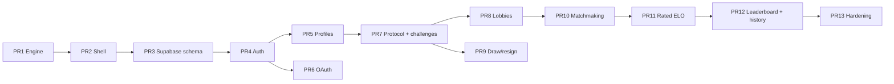

# 16spaces implementation roadmap

| Field | Value |
| --- | --- |
| **Status** | Draft / planning |
| **Date** | 2026-08-16 |
| **Companion** | [spec.md](spec.md), [design.md](design.md) |

Incremental plan to take the local hot-seat prototype to serverless multiplayer. `/local` stays green in every PR. No new product or schema decisions here — they live in spec and design.

---

## Goals (v1)

- Playable **rated** and **unrated** online games, two humans, server-validated rules and clocks.
- **Auth:** email/password, magic link, GitHub, Google, anonymous guest.
- **Profiles:** unique username, created_at, rating, W/L/D, match history. Avatar is initials / generated, not uploaded.
- **Lobbies:** private code/link, public list, host options, ready, presence, host transfer, idle expiry.
- **ELO matchmaking** with expanding window, serverless pairing.
- **Game options** locked at start (time, increment, rated, color, privacy).
- **Local hot-seat** remains on `/local`.
- **Leaderboard** (top 50, min 5 rated games).
- AdSense remains on marketing/home surfaces; no PII in ad slots or client env.

## Non-goals (v1)

- Spectators, tournament brackets, bots, analysis board, puzzles.
- Changing board size, stone cap, adjacency, or win length.
- Draw by repetition / insufficient material / 50-move.
- Account linking / guest upgrade (Phase 2).
- Avatar uploads / Supabase Storage.
- Custom domains, native apps, i18n.
- Chat.
- Redis, Deno KV as source of truth, Fly machines, Socket.io, long-lived WS game servers.
- Fresh 2 migration.

## Phase 2 (not scheduled in these PRs)

- Link guest → email/OAuth.
- Spectators.
- Optional in-game chat with report/block.
- Puzzle / daily + bot using `lib/game`.
- Avatar upload.

---

## Feature flags

Read in `lib/flags.ts`. Code: `flag(name) => Deno.env.get(name) === "true"`. Omit or any other value → **false**.

| Env | Default | Gates (**create only**) |
| --- | --- | --- |
| `FEATURE_AUTH` | false | `POST` signup/login/magic/guest/oauth start. Existing sessions still authenticate. |
| `FEATURE_ONLINE` | false | Create/join/start lobby, `POST /api/challenges`. Home buttons. |
| `FEATURE_MATCHMAKING` | false | `POST /api/matchmaking/enqueue` only. |
| `FEATURE_RATED` | false | Rated enqueue, `PATCH rated=true`, start of a rated lobby. In-flight rated games still write ELO. |

**Never 404 these when a flag is off** if the caller is a participant:

- `GET/POST /api/games/:id/**` (move, claim-timeout, resign, draw, heartbeat, abort)
- `GET /play/:id`
- `POST /api/matchmaking/tick|cancel` for an existing ticket
- `GET /api/lobbies/:code` for a member
- `POST /api/lobbies/:code/leave`, `ready`, `heartbeat`
- `GET /api/challenges`, `GET /c/:id`
- `GET /api/auth/session`, logout

Rollback = flip the newest flag to `false` (or revert the git SHA). Schema stays. In-flight games finish.

**Preview Deploy:** one shared Supabase project. Preview env leaves all `FEATURE_*` unset. Production secrets stay on the production Deno Deploy project.

---

## Rollout stages

Keep `/local` green. One production project (`16spaces` on Deno Deploy, existing `.github/workflows/deploy.yml`).

| Stage | Flag | What users see on 16space.deno.dev |
| --- | --- | --- |
| 0 (today) | all off conceptually | Hot-seat on `/` |
| 1 | — | Hot-seat moves to `/local`; home is a menu |
| 2 | `FEATURE_AUTH=true` | Sign in / guest; still local-only play |
| 3 | `FEATURE_ONLINE=true` | Lobbies + online games unrated |
| 4 | `FEATURE_MATCHMAKING=true` | Unrated queue |
| 5 | `FEATURE_RATED=true` | Rated queue + leaderboard |

`routes/local.tsx` + `islands/GameManager.tsx` never depend on Supabase.

### Migrations (apply in numeric order)

1. `0001_init.sql` — PR 3
2. `0002_challenges.sql` — PR 7
3. `0003_lobbies.sql` — PR 8
4. `0004_matchmake.sql` — PR 10
5. `0005_ratings.sql` — PR 11

---

## PR Plan

Each PR is independently reviewable and mergeable. Flags default so production stays local-only until a later env change. Tests travel with the engine and with any RPC SQL.

### PR 1 — Extract `lib/game` and fix local rules bugs

- **Title:** Extract shared game engine and fix board-state bugs
- **Depends on:** none
- **Files:** `lib/game/types.ts`, `board.ts`, `notation.ts`, `rules.ts`, `clock.ts`, `time_controls.ts`, `index.ts`, `lib/game/*.test.ts`, `islands/Board.tsx`, `islands/GameManager.tsx`, `deno.json` (`lib/` + `test` task)
- **Description:** Move `isAdjacent`, `countStones`, `checkWin`, place/slide, notation, **and the full clock helper** into `lib/game` (the same surface online will call). Allocate independent rows. Single `currentPlayer` in `GameManager`. `Board` emits intents. Local clock and reset unchanged (clock still starts after first move via `turnStartedAt === null`). Tests: win lines (3-long diagonal is not a win), stone cap, adjacency, row independence, **flag-fall does not place the stone**, `afterLegalMove` with null start uses stored remaining, ply-cap at 400, **first local move succeeds when `clocksStarted` is false and then starts the clock**.

### PR 2 — App shell, routes, home menu, `/local`

- **Title:** Add app shell and move hot-seat to `/local`
- **Depends on:** PR 1
- **Files:** `components/Layout.tsx`, `routes/index.tsx`, `routes/local.tsx`, `routes/_app.tsx`, `routes/_404.tsx`, `islands/HomeMenu.tsx`, `islands/GameManager.tsx` (time preset select bound to former `maxTime`)
- **Description:** Home becomes Welcome + Play Local (other buttons can render disabled or hidden). Deduplicate titles and AdSense. Dark 404. Production still playable (one extra click to `/local`).

### PR 3 — Supabase project wiring and first migration

- **Title:** Add Supabase clients, env, and v1 schema migrations
- **Depends on:** PR 2
- **Files:** `lib/supabase.ts`, `lib/flags.ts`, `.env.example` (includes `SUPABASE_JWT_SECRET`), `supabase/migrations/0001_init.sql` (citext, enums, tables except `challenges`, indexes including `lobbies_public_list`, RLS, `SECURITY DEFINER public_lobbies`, trigger, `expire_stale_lobbies`, `healthcheck`, `REPLICA IDENTITY FULL` + publication), `routes/api/health.ts`, `deno.json` supabase + jose imports
- **Description:** No user-facing auth UI. Health uses `supabaseAdmin().rpc('healthcheck')`. Dashboard steps in the PR body (Auth providers off until PR 4–6; Realtime enabled on the published tables). All `FEATURE_*` default false. `challenges` and matchmake/rating RPCs are later migrations.

### PR 4 — Session middleware, email/password, magic link, guest

- **Title:** Supabase Auth with httpOnly cookies and guest play
- **Depends on:** PR 3
- **Files:** `lib/auth_cookies.ts`, `lib/auth.ts` (`verifyAccessJwt`), `routes/_middleware.ts`, `routes/login.tsx`, `routes/signup.tsx`, `islands/AuthForm.tsx`, `routes/api/auth/signup.ts`, `routes/api/auth/login.ts`, `routes/api/auth/magic.ts`, `routes/api/auth/guest.ts`, `routes/api/auth/callback.ts`, `routes/api/auth/logout.ts`, `routes/api/auth/session.ts`
- **Description:** Cookie adapter (K15), **jose + `SUPABASE_JWT_SECRET` verify** (K21), `Secure` iff https, refresh path, `X-Request-Id`. Guest updates placeholder → `GuestXXXX` via admin (`is_guest` not client-writable). Callback without `sb-pkce` → 400 same-browser message. No OAuth yet. `FEATURE_AUTH=true` in prod after verify.

### PR 5 — Profiles and username

- **Title:** Profiles, unique usernames, `/settings`
- **Depends on:** PR 4
- **Files:** `lib/username.ts`, `routes/settings.tsx`, `islands/UsernameForm.tsx`, `routes/api/me.ts`, `routes/u/[username].tsx` (stub history)
- **Description:** Trigger already inserted `user_*`. Settings claims a real name. OAuth/email-without-name land here. Reserved list + 30-day rename. Rated blocked on `^user_`. `GET /api/me` does **not** yet sweep games (that is PR 11).

### PR 6 — OAuth GitHub and Google

- **Title:** Add GitHub and Google OAuth
- **Depends on:** PR 4 (parallel to PR 5)
- **Files:** `routes/api/auth/oauth/[provider].ts`, `routes/api/auth/callback.ts` (PKCE cookie), `islands/AuthForm.tsx` buttons
- **Description:** Dashboard client IDs. Redirect `SITE_URL/api/auth/callback`. After exchange, if username is `user_*`, 303 `/settings?next=`.

### PR 7 — Authoritative online game protocol + challenges

- **Title:** Server-authoritative games, clocks, challenges, slim OnlineGame
- **Depends on:** PR 5
- **Files:** `supabase/migrations/0002_challenges.sql` (`challenges` + RLS + `accept_challenge` + replica identity + publication), `lib/resolve_clocks.ts`, `lib/engagement.ts`, `lib/realtime.ts`, `routes/api/challenges/index.ts`, `routes/api/challenges/[id]/index.ts`, `routes/api/challenges/[id]/accept.ts`, `routes/api/challenges/[id]/decline.ts`, `routes/api/challenges/[id]/cancel.ts`, `routes/c/[id].tsx`, `islands/ChallengeRoom.tsx`, `routes/api/games/[id]/index.ts`, `routes/api/games/[id]/move.ts`, `routes/api/games/[id]/claim-timeout.ts`, `routes/api/games/[id]/heartbeat.ts`, `routes/api/games/[id]/abort.ts`, `routes/play/[id].tsx`, `islands/OnlineGame.tsx`
- **Description:** Challenges are the only pre-lobby creator. Inbox `GET /api/challenges` + shareable `/c/:id`. Unrated, 5-minute expiry-on-read. Challenger occupies `challenge_out`; 409 accept declines the row. `resolve_clocks` implements K17 (rated: no voluntary abort). `GET /play/:id` SSRs `{ game, moves, supabaseUrl, supabaseAnonKey, me: { id, username, rating } }` — **no JWT, no email**. Island: mount → heartbeat → session → subscribe. Heartbeat on focus + every 15s until clocks start. `clock.ts` is already in PR 1.

### PR 8 — Lobbies

- **Title:** Public and private lobbies with host options
- **Depends on:** PR 7
- **Files:** `supabase/migrations/0003_lobbies.sql` (`join_lobby`, `start_lobby`), `routes/api/lobbies/index.ts`, `routes/api/lobbies/[code]/index.ts`, `routes/api/lobbies/[code]/join.ts`, `routes/api/lobbies/[code]/leave.ts`, `routes/api/lobbies/[code]/ready.ts`, `routes/api/lobbies/[code]/start.ts`, `routes/api/lobbies/[code]/heartbeat.ts`, `routes/l/[code].tsx`, `islands/LobbyRoom.tsx`, `islands/HomeMenu.tsx`, Presence dots on `OnlineGame`/`Sidebar`
- **Description:** `join_lobby` / `start_lobby` RPCs, `FOR UPDATE` capacity, expire-on-read (never expire `started` while game is `active`), K18 start-if-only-this-lobby, rated/guest invariants, play-again, host transfer. Non-member GET leaks no board. Set `FEATURE_ONLINE=true`. Hide challenge **create** on home; inbox + `/c/:id` stay.

### PR 9 — Resign and draw agreement

- **Title:** Resign and draw offer/accept
- **Depends on:** PR 7 only (parallel to PR 8 and PR 10)
- **Files:** `routes/api/games/[id]/resign.ts`, `routes/api/games/[id]/draw.ts`, `islands/Sidebar.tsx`
- **Description:** Anytime draw; mutual offer = accept; move declines; resign beats draw. Draw/resign before handshake → 403. `winState: "X" | "O" | "draw" | "aborted" | null`.

### PR 10 — Unrated matchmaking

- **Title:** Serverless unrated queue with expanding window
- **Depends on:** PR 8 only (does **not** depend on PR 9)
- **Files:** `supabase/migrations/0004_matchmake.sql`, `routes/api/matchmaking/enqueue.ts`, `routes/api/matchmaking/tick.ts`, `routes/api/matchmaking/cancel.ts`, `routes/api/matchmaking/status.ts`, `routes/queue.tsx`, `islands/QueueWait.tsx`, `lib/matchmaking.ts`
- **Description:** `FOR UPDATE SKIP LOCKED` pair, 3s tick, cancel, 200-on-second-enqueue, engagement lock, queue key `(rated=false, time_control_id)`. `FEATURE_MATCHMAKING=true`. Color random. Handshake clocks still apply.

### PR 11 — Rated play and ELO

- **Title:** Rated games, provisional K-factor, rating events
- **Depends on:** PR 10
- **Files:** `lib/elo.ts` + tests, `supabase/migrations/0005_ratings.sql` (`apply_game_result`), rated enqueue path, guest/`user_*` rejection, `routes/api/me.ts` sweep
- **Description:** K=40/20, `Math.round` + floor 100 clamp, abort unrated, timeout/resign/no-move/draw/ply-cap rate. **This PR owns `GET /api/me` → `resolve_clocks` on the caller's active games** (unrated finalize already existed in PR 7 on GET game).

### PR 12 — Leaderboard and match history

- **Title:** Leaderboard and profile match history
- **Depends on:** PR 11
- **Files:** `routes/leaderboard.tsx`, `routes/api/leaderboard.ts`, `routes/u/[username].tsx`, `routes/api/u/[username].ts`
- **Description:** Top 50, min 5 rated games, `supabaseAnon()`. History shows color, opponent, result, rating delta, time control, date. Link from completed `/play/:id`.

### PR 13 — Hardening: rate limits, observability, ads/PII pass

- **Title:** Rate limits, observability, PII/ads audit
- **Depends on:** PR 12
- **Files:** `lib/rate_limit.ts` (upsert + 2-window delete), call sites on enqueue/move/lobby/challenge, structured logs (`requestId`, `authMs`, `pgMs`)
- **Description:** 429s, ads only on `/`, no email/JWT in island props, health includes flag state. Does **not** re-own the `/api/me` sweep.

---

## Open questions

These are unresolved on purpose. Everything else in spec/design is a decision.

1. **Custom domain** vs stay on `16space.deno.dev` (OG tags and share links assume the latter).
2. **Email confirmation:** currently **off**. Turn on if abuse appears; magic link remains.
3. **Phase 2 account linking priority** vs spectators vs chat.
4. **Whether preview Deploy projects get their own Supabase branch** once traffic is non-zero.
5. **Region pairing** of the existing Deploy project and the new Supabase project (measure RTT before rated launch). Prefer the same region; if undecided, `us-east-1` for both.

---

## Risks

| Risk | Severity | Mitigation |
| --- | --- | --- |
| Missed match when two players enqueue in parallel | High | 3s `tick` retries pairing; unique queued ticket |
| Flag-fall never applied if both clients close | Med | `GET /api/me` and `GET /api/games/:id` run `resolve_clocks`. Abort wins over timeout at ply 0 without heartbeats. |
| Realtime RLS misconfig leaks boards | High | Tests: second user JWT cannot `select` a foreign game; Realtime only on listed tables |
| Clock drift / tab freeze looks like desync | Low | Display from timestamps; snap to server snapshot on every event |
| Cold start + PG RTT exceeds 250ms | Med | Same region; verify JWT locally with `SUPABASE_JWT_SECRET`; log `authMs` vs `pgMs` |
| Guest farm / rated evasion | Med | Rated requires `is_guest=false` written only by admin; no rated `POST /abort` |
| Unsigned cookie impersonation | High | jose HS256 verify before any `ctx.state.user` / admin RPC |
| `Array.fill` bug reintroduced | Low | Engine unit test for row independence |
| AdSense policy on a game with usernames | Low | Ads only on `/`; no PII |
| Supabase free-tier pause after inactivity | Med | Operator pings `/api/health` or paid compute once launched |
| Duplicate titles / messy `_app.tsx` ships to OG scrapers | Low | Fixed in shell PR (PR 2) |
